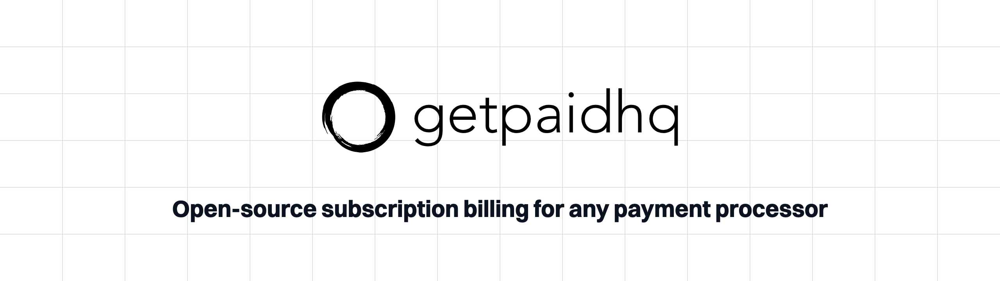

<div align="center">



<br/>

[](https://go.dev)
[](LICENSE)
[](https://github.com/getpaidhqco/getpaidhq/actions/workflows/go-test.yml)

**Self-hostable subscription billing that plugs into any payment gateway.**

[What it does](#what-it-does) · [Why it exists](#why-it-exists) · [How it's built](#how-its-built) · [API](docs/openapi.yml)

</div>

---

Open-source subscription billing for any payment processor - self-hostable subscription billing that plugs into any gateway.

It handles checkouts, subscriptions, invoicing, usage metering, dunning, and it is processor-agnostic, so you bring your own payment gateway. 

It currently supports Paystack and Checkout.com, and adding another processor means implementing a single gateway interface.

## What it does

**Subscriptions** - fixed-price, usage-based, or hybrid plans. Trials, pauses,
resumes, cancellations, proration, plan changes, and configurable billing anchor
dates.

**Invoicing** - invoice-centric billing with line items, invoice history, credit
notes, and document sequencing. Idempotent payment handling means retries never
double-charge.

**Pricing & products** - a product catalog with variants and prices, supporting
multiple pricing schemes and tiered pricing, across multiple billing intervals and currencies.

**Usage metering** - define meters, send usage events, and ingest them. Drives usage-based and hybrid plans.

**Dunning** - durable recovery campaigns retry failed charges on a schedule,
with configurable scope, customer communications, payment-update
tokens so customers can fix their own details, and dunning analytics.

**Checkouts & Payment links** - hosted checkouts and shareable links with pre-populated customer details and carts.

## Why it exists

I built the first version because I needed to process subscription payments using a local payment processor. 
The processor's native subscription processing was bare bones and lacking modern features like 
smart retries, dunning, easy details updates etc., and I couldn't find a solution that fit my needs.
Especially it needed to be easy to deploy and support, and relatively cost-effective to host.

This is the evolution of that first release (which is still running in production) and expanded to 
include more features like metering and usage based billling, and flexibility to support different technologies and payment processors.

## How it's built

**Ports and adapters** - Hexagonal architecture makes it easy to add/swap underlying technologies and vendors.

**Pluggable auth** makes user authenticators easy to change (Cognito, Clerk)

**Durable workflows** ensures scalable and fault-tolerant processing.

**Self-hostable** - Easy to deploy, MIT licensed


## Getting started

You'll need Docker, Go 1.26+, and make. From the repo root:

```bash
cp .env.example .env # then fill in provider secrets as needed
make up              # start Postgres, Redis, NATS, and hatchet-lite
make db-migrate-all  # apply the Goose schema migrations to all three databases
make run             # start the API
```

The database schema is managed with [Goose](https://github.com/pressly/goose) migrations under `schemas/<db>/migrations/` (operational, reporting, usage); create new ones with `make db-migrate-create name=...`.

Hatchet needs a token minted before the first run - see the bootstrap notes in [docker/docker-compose.yml](docker/docker-compose.yml) and the `HATCHET_CLIENT_*` vars in `.env.example`. Run `make help` to see every available target.

The REST API is mounted under `/api`. The running server serves its live OpenAPI spec as JSON at `GET /openapi.json`. The committed contract is `docs/openapi.yml`, regenerated on demand with `make openapi` - the server never writes it on boot.

## CLI

`gphq` is a command-line client for the API, covering every endpoint with table or JSON output. Install it with `make install-cli` (or `make build-cli` for a local `bin/gphq`), then point it at a server with `GPHQ_BASE_URL` and `GPHQ_API_KEY`. Run `gphq --help` for the command reference.

## Documentation

- [docs/architecture/system-hexagonal.md](docs/architecture/system-hexagonal.md) - architecture map
- [docs/workflows/](docs/workflows/README.md) - billing, dunning, and workflow-engine docs
- [docs/openapi.yml](docs/openapi.yml) - API contract

## License

GetPaidHQ is licensed under the [MIT License](LICENSE).