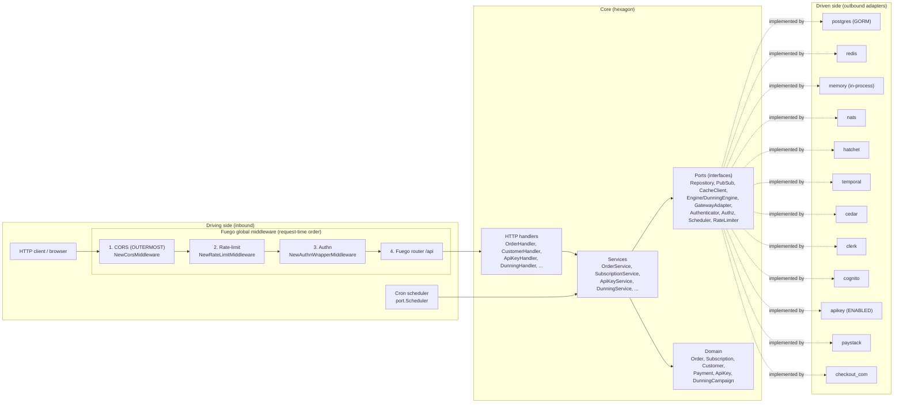
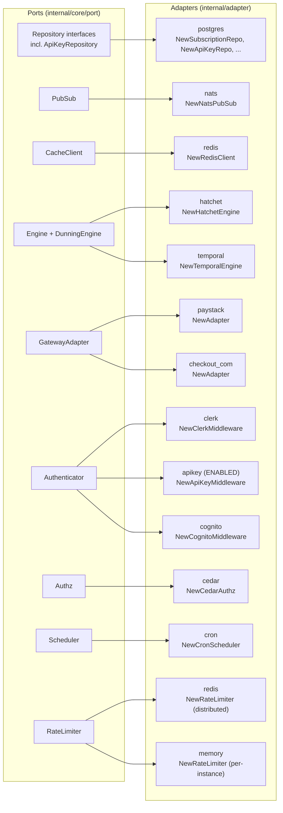

# System Architecture (Hexagonal / Ports & Adapters)

GetPaidHQ is a Go subscription-billing backend built on ports-and-adapters (hexagonal) architecture. Driving adapters (the Fuego HTTP API and the cron scheduler) call inward through the core's service layer; the core depends only on `port` interfaces, never on concrete infrastructure. Driven adapters (Postgres, Redis, NATS, Hatchet/Temporal, Cedar, Clerk, Cognito, API-key, Paystack, Checkout.com) implement those ports and are injected at boot by `NewApp` in `internal/config/app.go`.

As of commit `a46c4e0`, **API-key authentication is enabled** as a real `port.Authenticator` (alongside Clerk), and the **global middleware order was changed so CORS is now the OUTERMOST layer**. The full request-time chain is `CORS -> rate-limit -> authn -> router`, wired in `BuildServer` in `internal/config/server.go`.

## How it works

### Boot and wiring
`NewApp` in `internal/config/app.go` constructs every repository, infrastructure adapter, service and handler by hand (no DI container), then calls `BuildServer` in `internal/config/server.go` to assemble the Fuego server. Long-lived resources (NATS pubsub, the workflow-engine worker, the cron scheduler, and the Redis rate limiter when present) are collected as `io.Closer`s and torn down in reverse order by `App.shutdown` on `SIGTERM`/interrupt.

### Middleware order: CORS is outermost
`BuildServer` appends middleware to a slice passed to `fuego.WithGlobalMiddlewares`, which runs the **last** appended entry **outermost**. The slice is built in the reverse of execution order: authn first, then rate-limit, then CORS last, producing the request-time chain `CORS -> rate-limit -> authn -> router`.

CORS (`middleware.NewCorsMiddleware`) is outermost on purpose: `rs/cors` writes `Access-Control-Allow-Origin` on the way in before delegating to the next handler. If CORS sat inside authn or rate-limit, a `401` from the authenticator or a `429` from the limiter would be returned **without** CORS headers, and the browser would surface it as an opaque "Failed to fetch" instead of a debuggable HTTP status. Keeping CORS outermost guarantees every response — success or failure — carries the correct CORS headers. Rate-limit (`middleware.NewRateLimitMiddleware`) sits inside CORS but outside authn so it sheds abusive callers before the relatively expensive authenticator chain and protects the auth path from brute-force/floods; it is keyed by the securely-resolved client IP (`handler.ClientIP` with `handler.ParseTrustedProxies`) and is a pass-through when `RATE_LIMIT_RPS` is non-positive or the backend is nil. Authn (`middleware.NewAuthnWrapperMiddleware`) is innermost of the three and is only attached when at least one `port.Authenticator` is supplied.

### Authentication: Clerk + API-key (both enabled)
`NewApp` builds `authenticators := []port.Authenticator{clerkAuth, apiKeyAuth}`. Clerk (`clerk.NewClerkMiddleware`) is tried first; a non-Clerk token (an `x-api-key` value) fails its check and falls through to the API-key authenticator (`apikey.NewApiKeyMiddleware`). The two token shapes are disjoint, so order only decides which authenticator "wins" a token it can actually validate. `ApiKeyMiddleware.Authenticate` in `internal/adapter/apikey/middleware.go` hashes the raw key with the server pepper via `lib.HashApiKey`, looks it up through `ApiKeyRepo.FindByKey` (HMAC-hash lookup on a unique index, no timing leak) in `internal/adapter/storage/postgresgorm/api_key_repo.go`, and returns a `port.AuthUser` carrying the key's `OrgId` with `RoleAdmin`.

### API-key handler / service / repo
The full API-key slice is registered in `config.Handlers`:
- Handler `handler.NewApiKeyHandler` in `internal/adapter/http/api_key_handler.go` exposes `GET/POST /api/api-keys` and `DELETE /api/api-keys/{id}`, gating each route through `port.Authz` (`ActionCreateApiKey`, `ActionListApiKeys`, `ActionDeleteApiKey`). The plaintext key is returned exactly once from `Create`.
- Service `service.NewApiKeyService` in `internal/core/service/api_key.go` mints keys of the form `sk_{id}_{secret}`, hashes them with the pepper, and side-channels the raw key back on creation only.
- Repo `postgres.NewApiKeyRepo` implements `port.ApiKeyRepository` (`internal/core/port/repository.go`).

### Authorization
`cedar.NewCedarAuthz` implements `port.Authz`; handlers call `Enforce(authUser, action, resource)` before doing work. Policies live in `policy.cedar`: `admin` may perform any action but only when `principal.org_id == resource.org_id`, and `owner` is granted an explicit action list that includes the API-key actions.

### Workflow engine selection
`WORKFLOW_ENGINE` (default `hatchet`) selects the orchestration adapter in `NewApp`. Both `hatchet.NewHatchetEngine` and `temporal.NewTemporalEngine` return a concrete type satisfying both `port.Engine` and `port.DunningEngine` (`internal/core/port/workflow.go`, `internal/core/port/dunning.go`); an unrecognized value returns `errUnsupportedEngine` for a clean startup failure. `service.NewSubscriptionEventBridge` fans `subscription.*` NATS topics into the chosen engine.

### Other driven ports
`nats.NewNatsPubSub` implements `port.PubSub`; `redis.NewRedisClient` implements `port.CacheClient`; the rate limiter is `redis.NewRateLimiter` (distributed, cluster-wide budget) when `REDIS_HOST` is set, otherwise `memory.NewRateLimiter` (per-instance), both implementing `port.RateLimiter`. Payment gateways are registered in a `map[domain.Gateway]port.GatewayAdapter` with `paystack.NewAdapter` and `checkout_com.NewAdapter`, consumed by `service.NewGatewayFactory`. `cron.NewCronScheduler` implements `port.Scheduler`.
