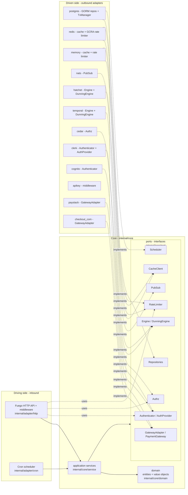
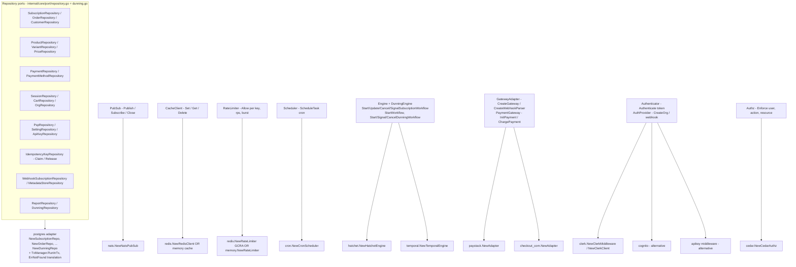

# System Architecture (Hexagonal / Ports & Adapters)

GetPaidHQ (the `getpaidhq` module, a.k.a. payloop) is a Go subscription-billing backend built as a hexagon: a pure core (`internal/core`) surrounded by adapters (`internal/adapter`). The core declares **ports** — Go interfaces in `internal/core/port` — and adapters implement them. Dependencies point **inward only**: adapters import `internal/core/port` and `internal/core/domain`, but the core imports no adapter. There is no DI framework; everything is hand-wired in `NewApp` in `internal/config/app.go`, including the `WORKFLOW_ENGINE` switch that picks Hatchet (default) or Temporal behind the same `port.Engine`.

## The hexagon

## Ports and their adapters

## How it works

**Composition root.** `NewApp` in `internal/config/app.go` constructs everything top-down: two GORM `*gorm.DB` handles via `postgres.NewDatabase` (operational + reporting, falling back to the primary if `REPORTING_DATABASE_URL` is absent), a `postgres.NewTxManager`, then every `postgres.New*Repo`, then the infrastructure adapters (`nats.NewNatsPubSub`, `redis.NewRedisClient`, `cedar.NewCedarAuthz`, `cron.NewCronScheduler`), then services, then HTTP handlers. The function returns errors rather than panicking so a bad config exits cleanly.

**Driving side (inbound).** HTTP is the primary driver. `BuildServer` in `internal/config/server.go` builds a `*fuego.Server`, sets slowloris timeouts on the embedded `*http.Server`, groups routes under `/api`, and calls each handler's `RegisterRoutes`. Global middleware is appended so the request-time order is **rate-limit → authn → cors → router** (fuego runs the last-appended middleware outermost). `middleware.NewRateLimitMiddleware` keys on the trusted-proxy-resolved client IP (`handler.ClientIP`) and is opt-in via `RATE_LIMIT_RPS`; `middleware.NewAuthnWrapperMiddleware` runs the `[]port.Authenticator` chain, skipping `port.PublicPaths` (`/api/health`, `/api/notify`). Handlers depend on application services plus `port.Authz` (`internal/adapter/http`). The second driver is the cron `port.Scheduler`, used by `service.NewReportService` and `service.NewCustomerService` to register periodic tasks.

**Core.** Application services live in `internal/core/service` (e.g. `service.NewSubscriptionService` in `internal/core/service/subscription.go`, `service.NewOrderService`, `service.NewDunningService`). They depend only on ports and `domain`. Engine-aware orchestration is layered on top: `service.NewSubscriptionOrchestrationService` wraps `subService` + `port.Engine`, and `service.NewDunningOrchestrationService` wraps the dunning service + `port.DunningEngine`. HTTP handlers call orchestration services; workflow steps/activities call the narrow domain services — keeping orchestration out of the durable layer.

**Driven side (outbound).** Adapters implement ports and never leak their tech across the boundary. The postgres repos translate driver errors to `port.ErrNotFound` so services can `errors.Is` without importing GORM, and `port.TxManager.RunInTx` threads the tx through `ctx` (used with `FindByIdForUpdate`'s `SELECT ... FOR UPDATE` for subscription state transitions). `port.IdempotencyKeyRepository.Claim`/`Release` give webhook handlers atomic exactly-once semantics. Payment gateways are selected at runtime: `gatewayAdapters` maps `domain.Paystack`→`paystack.NewAdapter` and `domain.CheckoutDotCom`→`checkout_com.NewAdapter`, and `service.NewGatewayFactory` resolves the right `domain.GatewayProvider` per org from `PspRepository`/`SettingRepository` config.

**Rate limiter / cache backend selection.** In `NewApp`, if `REDIS_HOST` is set the `port.RateLimiter` is `redis.NewRateLimiter` (a cluster-wide GCRA budget); otherwise `memory.NewRateLimiter` (per-instance). The middleware fails open on backend errors, so neither is a hard dependency.

**Workflow engine parity.** `WORKFLOW_ENGINE` (default `hatchet`) selects the `port.Engine` + `port.DunningEngine` implementation; an unrecognized value returns `errUnsupportedEngine`. Both adapters take the same engine-agnostic services in their constructors. For Temporal, `temporalact.NewOrderActivities`/`NewOutgoingWebhookActivities`/`NewDunningActivities` are passed to `temporal.NewTemporalEngine`; for Hatchet, `hatchetsteps.NewOutgoingWebhookSteps`/`NewDunningSteps` are passed to `hatchet.NewHatchetEngine`. The engine drives a per-subscription durable runner: `NewSubscriptionRunnerWorkflow` in `internal/adapter/hatchet/workflows/subscription_runner.go` awaits event keys defined in `keys.go` — `SubscriptionRunKey` (idempotent run key), `UpdateEventKey` (`subscription.paused/resumed/cancelled/activated`, `refresh-state`), `CancelEventKey`, `WebhookEventKey` (resolves a `Pending` payment with a `domain.ChargeResult`), plus `ReminderRunKey`/`BillingRunKey` for de-duped spawns. Dunning uses the parallel keys in `dunning_keys.go` (`DunningRunKey`, `DunningSignalKey`, `DunningPaymentMethodUpdatedKey`).

**Event bridges.** `service.NewSubscriptionEventBridge` subscribes the chosen engine to `subscription.*` NATS topics so both engines share one fan-in path; `service.NewReportEventBridge` projects domain events into the reporting DB. These are wired in `NewApp` and fail the boot on a subscribe error.

**Shutdown.** `NewApp` collects long-lived resources implementing `io.Closer` (`pubsub` always; the engine worker, cron scheduler, and Redis rate limiter when applicable). `App.Run` runs `fuego`'s blocking `Server.Run` in a goroutine, owns `SIGINT`/`SIGTERM` via `signal.NotifyContext`, drains HTTP with a 10s `Server.Shutdown`, then `App.shutdown` closes resources in reverse construction order (best effort).
