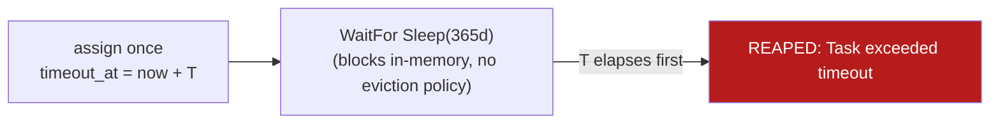
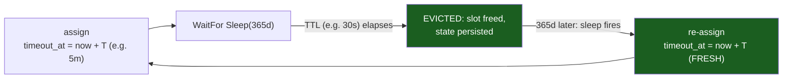

# Durable runner timeouts — why `subscription-runner` runs fail at ~5 min

> **Load-bearing.** This documents a real failure mode of the per-subscription durable runner and
> a design constraint that affects **all** long-sleeping durable tasks (subscription-runner,
> dunning-runner). Findings are grounded in the Hatchet source at
> `/Users/mdwt/dev/gphq/research/hatchet` (v0.88.4).

## Symptom

In the Hatchet UI, `getpaidhq_subscription-runner` showed **3 Failed runs**, each lasting almost
exactly **5 minutes**. Run event log:

```
17m ago  Started / Assigned to worker
17m ago  [durable wait] any of: waiting for event cancel:…:sub_…,
         sleeping for 2591999963ms, waiting for refresh-state:…, 4 more
12m ago  error: Execution timed out: Task exceeded timeout of …      ← 5 min after start
```

`2591999963ms` ≈ **30 days** — the runner correctly computed the wait until the next monthly
charge. Then it was killed 5 minutes in.

## Root cause

The runner is registered with **no execution timeout**:

```go
// internal/adapter/hatchet/workflows/subscription_runner.go
return client.NewStandaloneDurableTask("subscription-runner", fn)   // ← no WithExecutionTimeout
```

Compare its short-lived children, which DO set one:

| Workflow | Execution timeout | Source |
| --- | --- | --- |
| `subscription-charge-reminder` | `10s` | `subscription_charge_reminder.go:33` |
| `billing-cycle` / `charge-customer` | `60s` (+ `WithRetries(50)`, backoff `1.2`/`600s`) | `billing_cycle.go:25-27` |
| `subscription-runner` | **unset → 5 min default** | — |
| `dunning-runner` | **unset → 5 min default** | same shape, same bug |

When unset, Hatchet applies a **5-minute default**, and **durable waits are NOT exempt** from it.
So the 30-day `WaitFor` blows the 5-minute ceiling every time. Deterministic, not flaky.

### Source evidence (Hatchet v0.88.4)

- **5-minute default** when `step_timeout` is `NULL`:
  `convert_duration_to_interval(NULL)` → `ELSE '5 minutes'::interval`
  (`cmd/hatchet-migrate/migrate/migrations/20240321215205_v0_17_1.sql:17`).
- **`timeout_at` set at assignment:**
  `CURRENT_TIMESTAMP + convert_duration_to_interval(t.step_timeout)`
  (`pkg/repository/sqlcv1/queue.sql:203`).
- **Reaper** checks `timeout_at <= NOW()` (`pkg/repository/sqlcv1/tasks.sql` `ListTasksToTimeout`)
  and emits the exact string `"Task exceeded timeout of %s"` (`pkg/repository/task.go:1276`).
- **`scheduleTimeout`** (default `'5m'`, `workflows.sql:300`) is a *different* timeout — it bounds
  time spent waiting to be **assigned** to a worker, not execution time. The error we saw is the
  **execution** timeout, not the schedule timeout.

## "Failed runner" ≠ "subscription died"

- The **subscription row is intact** in Postgres — no data lost, status unchanged.
- But its **durable orchestration is dead**: nothing now drives billing, renewal, or reacts to
  pause/cancel/webhook events **for that subscription**.
- It is **revivable**: the runner is idempotent by run key `sub_<org>_<sub>`, so a new
  `StartSubscriptionWorkflow` (e.g. on the next payment event, or a manual re-trigger) brings it
  back. The `billing-cycle` key includes `CyclesProcessed`, so no double-charge.

## The compounding bug: infra errors are fatal to the runner

Even with the timeout fixed, the runner has a second issue. In
`subscription_runner.go`, a billing **infrastructure** error is fatal:

```go
billingRes, err := client.Run(ctx, "billing-cycle", ...)
if err != nil { return sub, err }                     // ← kills the durable loop
...
if err := billingRes.TaskOutput("charge-customer").Into(&chargeResult); err != nil {
    return sub, err                                   // ← kills the durable loop
}
```

- A **declined card** is handled gracefully: `billing-cycle` returns a `ChargeResult{Failed}` →
  `HandleSubscriptionChargeFailure` → dunning. ✅
- A **failure to even charge** (e.g. **no PSP `gateways`/`settings` configured**, DB error, panic)
  makes the step *error*, which propagates as `client.Run(...)` error → `return sub, err` → the
  whole durable runner dies. ❌

So a missing gateway (common on hand-seeded orgs — see [org-seed-data.md](org-seed-data.md)) +
the missing timeout **compound**: fix the timeout and the runner still reaches billing, fails to
build a gateway, and dies again.

## ⚠️ The annual-subscription problem (the hard part)

The runner is a **loop** — `for { … WaitFor(Sleep(next charge)) … }` — and sleeps for the **whole
billing interval**: ~30 days for monthly, **~365 days for annual**.

A second source investigation found that **`timeout_at` is computed once at first assignment and is
NOT reset on each durable-wait resumption** (it's only refreshed in the eviction branch):

- `pkg/repository/sqlcv1/queue.sql:230-235` — the assignment `ON CONFLICT … DO UPDATE SET
  timeout_at = EXCLUDED.timeout_at` fires **only `WHERE v1_task_runtime.evicted_at IS NOT NULL`**.
- Durable-event satisfaction (`internal/services/controllers/task/durable_callbacks.go:16-96`)
  sends a `DurableCallbackCompletedMessage` to the **same dispatcher** — it does **not** re-queue /
  re-assign the task, so no new `timeout_at` is computed.
- Net: a non-evicted durable task **blocks in a single in-memory execution** with **one**
  `timeout_at` for its entire lifetime.

### What this means — WITHOUT eviction (our current state)



With **no eviction policy** (our runner's state), the task blocks in-memory and `timeout_at` never
resets, so it dies at `firstAssign + T` regardless of cycle. A naive `WithExecutionTimeout(400d)`
survives the first annual sleep but a multi-year subscription still dies later. So *in this
configuration*, no finite timeout makes loop-forever correct.

### ✅ CORRECTION — eviction is the real fix (resolves the earlier "must re-architect" claim)

An earlier version of this doc concluded "no finite timeout works, you must re-architect." **That
was too strong.** The missing mechanism is **opt-in eviction**, and it makes the loop-forever
durable actor viable on Hatchet:

- `EvictionPolicy{TTL, AllowCapacityEviction}` **exists in our pinned v0.86.5**
  (`sdks/go/eviction_policy.go`), with a `DefaultDurableTaskEvictionPolicy{TTL: 15m,
  AllowCapacityEviction: true}`.
- It is **opt-in**: `sdks/go/workflow.go:515` attaches a policy only `if config.evictionPolicy !=
  nil`. Our runner sets none → never evicted → blocks → reaped. **That is the bug**, not a
  fundamental limitation.
- With a policy whose **TTL < execution timeout**, the task is evicted *during* the long wait (slot
  freed, state persisted), and on resume it is **re-assigned with a fresh `timeout_at`** (the
  `ON CONFLICT … WHERE evicted_at IS NOT NULL` reset branch). The execution timeout then only needs
  to cover **one active compute window** (replay + one charge), not the sleep.



So the correct config is **`WithEvictionPolicy(TTL ≈ 30s)` + `WithExecutionTimeout(a few minutes)`**
(timeout > TTL). Monthly and annual both work; the loop runs forever.

### ⚠️ But eviction triggers REPLAY — side effects must be durable/idempotent

Eviction (and any worker restart) causes the durable task to **replay from the top**. Per
`pkg/worker/context.go:1016`, durable ops (`WaitFor`, `SleepFor`, child `client.Run`, `ctx.Now`)
return cached results on replay; **plain code re-executes** ("cached in process only … will not
survive replay").

- A bare `charge(subID)` inline call would **re-run on every resume → repeated charges**. It must be
  a child task with an idempotent run key. Our real runner is safe on the charge itself
  (`client.Run("billing-cycle", key=billing_<org>_<sub>_<cycle>)`).
- **BUT** the runner's post-charge work — `HandleSubscriptionChargeSuccess/Failure` and the pubsub
  publishes — are **plain calls**, so they would **double-apply under replay**. Enabling eviction on
  the current runner therefore requires making those steps durable or idempotent first. This is a
  prerequisite, not optional.

### The decisive constraint — an immortal task fights creation-time-partitioned retention (verified)

This, not the timeout, is the real reason an infinite per-subscription loop is wrong on Hatchet —
and eviction does **not** save it.

The durable event log is three tables (`sql/schema/v1-core.sql`), all
**`PARTITION BY RANGE(durable_task_inserted_at)`** — the task's *creation* timestamp (verified):

- `v1_durable_event_log_file` — one row per durable task (`latest_node_id`, `latest_branch_id`,
  `latest_invocation_count`).
- `v1_durable_event_log_entry` — one row **per durable operation** (`node_id` increments 0,1,2,… per
  task). A `SleepFor(365d)` is **one** entry — cost is in the *count* of steps, not their duration.
- `v1_durable_event_log_branch_point` + `v1_durable_sleep` (timer rows).

Retention is **partition drop by creation date**: `RetentionController`
(`internal/services/controllers/retention/`) drops partitions older than the tenant's
`DataRetentionPeriod` via `get_v1_partitions_before_date(...)` — same machinery as `v1_task` /
`v1_dag`. So:

- **Bounded task** (one annual charge+sleep, or a ~2-week dunning campaign): its whole log lives in
  its birth-date partition, the task completes, and the partition drops cleanly once past retention.
  Global log size stays bounded **no matter how many subscriptions you run**. ✅
- **Infinite per-subscription loop**: still running when its **birth-date partition** ages past the
  retention horizon — and retention is **liveness-blind**. `ListPartitionsBeforeDate` →
  `get_v1_partitions_before_date` selects partitions **purely by the date in the partition name**
  (no task-status join, no incomplete-work check), and `pkg/repository/task.go:352-411` then runs
  `DETACH PARTITION CONCURRENTLY` + `DROP TABLE` **unconditionally** (a parked task holds no
  transaction, so it can't block the detach; Postgres won't fail a DROP because some process "still
  cares"). So the GC **deletes the live task's entire durable event log out from under it,
  mid-flight** — it does *not* linger. After that the task is orphaned: replay reads find nothing
  (`BulkGetDurableEventLogEntries` → empty), and new durable writes have **no partition to land in**
  (`CreatePartitions` only makes daily ranges for today/tomorrow; there is **no DEFAULT partition**)
  → `no partition of relation found`. The retention model *assumes durable tasks complete inside the
  retention window*; a perpetual loop violates that and gets reaped. ❌ **Eviction (which fixes the
  timeout) does nothing here — the two are orthogonal.**

Two corollaries:

- **Cold-resume replay is ~O(completed steps).** The eviction manager's invocation/run state is an
  in-memory cache (`sdks/go/internal/eviction/cache.go`); after a worker redeploy it's cold, so the
  function re-executes from `node_id=0` and re-reads prior entries (`BulkGetDurableEventLogEntries`,
  `durable_events.go:940`). A task with thousands of prior steps re-walks them on every cold wake.
- **`DurableSleepLimit` (default 1000) is not a guardrail.** Despite the name it's a throughput knob
  — how many durable-sleep items the engine drains per tick (`pkg/config/server/server.go:128`,
  `pkg/repository/task.go:1407`) — **not** a per-task log cap. Don't lean on it.

**Net:** make each renewal a **fresh, short durable task** (the cron is the loop; each iteration is
a new task with a new `durable_task_inserted_at` → its own partition → dropped cleanly after
completion + retention). Dunning as **one bounded durable task per campaign** is fine (finite steps,
~2 weeks, ages out normally) — it just needs an eviction policy so its multi-day waits aren't
timeout-reaped. **Avoid** the immortal `for { charge; SleepFor(1yr) }` — not for timeout reasons
(eviction handles those), but because it's an immortal task fighting a creation-time-partitioned
retention model. See [subscriptions-on-hatchet.md](subscriptions-on-hatchet.md).

## Fix options

Ordered from tactical to correct:

1. **Tactical only (local-dev smoke test, NOT production):** set an execution timeout above the
   longest single sleep:
   ```go
   client.NewStandaloneDurableTask("subscription-runner", fn,
       hatchet.WithExecutionTimeout(400*24*time.Hour), // > 1 annual cycle
   )
   ```
   Survives the *first* cycle of any plan but, with no eviction, dies at `firstAssign + T` on a
   multi-year subscription. Use only to see a runner go green locally.

2. **Subscriptions → fresh short durable task per renewal (NOT an infinite loop):** a cron (or a
   self-`Schedules().Create` at cycle end) starts a **new** `billing-cycle` durable task per renewal.
   Each gets a new `durable_task_inserted_at` → its own retention partition → dropped cleanly after
   it completes. This is the only shape that satisfies the creation-time-partitioned retention model.
   > ❌ The infinite `for { charge; SleepFor(1yr) }` + eviction is **not** viable — eviction fixes
   > the timeout but the task is immortal and fights retention (see the constraint section above).
   > Eviction alone does not rescue it.

3. **Dunning → keep one bounded durable task per campaign, but add an eviction policy:** dunning is
   the *good* case for a durable task — finite step count, completes in ~2 weeks, ages out of
   retention normally. It only needs eviction so its multi-day progressive-retry sleeps aren't
   timeout-reaped:
   ```go
   client.NewStandaloneDurableTask("dunning-runner", fn,
       hatchet.WithExecutionTimeout(5*time.Minute),                 // > eviction TTL
       hatchet.WithEvictionPolicy(&hatchet.EvictionPolicy{
           TTL:                   30 * time.Second,                 // evict after 30s of waiting
           AllowCapacityEviction: true,
       }),
   )
   ```
   **Prerequisite:** eviction triggers replay-from-top, so every side-effect in the campaign loop
   must be a durable child task or idempotent (the attempt is a `dunning-attempt` child; check the
   state-update + comms paths).

4. **Make billing infra-errors non-fatal:** don't `return sub, err` on a `billing-cycle`
   infrastructure error — retry/route to dunning, so a transient PSP/DB blip (or missing gateway)
   doesn't tear down the work. Needed regardless.

5. **The strategic shape — cron + fan-out (Lago model):** an hourly Hatchet cron, sharded per
   tenant, that starts the per-renewal billing tasks from #2 and gates dunning attempts. This is the
   recommended direction; it makes #2 natural and sidesteps the timeout, replay, and retention
   issues for the billing path. See [subscriptions-on-hatchet.md](subscriptions-on-hatchet.md).

## Recommended order to get a green runner locally

1. Stopgap to stop the 5-minute kill while you smoke-test: option 1 on the runner.
2. Seed a test PSP `gateways` + `settings` pair — so `billing-cycle` can charge instead of erroring
   (see [org-seed-data.md](org-seed-data.md)).
3. Apply option 4 (non-fatal infra errors) so a blip doesn't kill the work.
4. Strategically: move subscriptions to fresh-task-per-renewal (#2/#5) and add an eviction policy to
   the bounded dunning runner (#3). See the decision table in
   [subscriptions-on-hatchet.md](subscriptions-on-hatchet.md).
