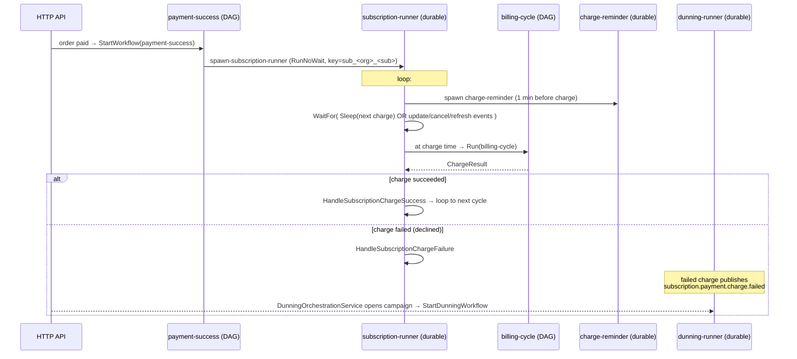

# Hatchet in this codebase — the mental model

> Source of truth for engine internals: the local Hatchet checkout at
> `/Users/mdwt/dev/gphq/research/hatchet` (v0.88.4). The gphq-server module pins v0.86.5.
> Query that checkout, not the `~/go/pkg/mod` cache, for engine behaviour.

## Vocabulary

| Concept | What it is | Where in the code |
| --- | --- | --- |
| **Worker** | One process that connects to the Hatchet engine over gRPC and advertises which workflows it can run. We run exactly **one**, named `getpaidhq-events`. | `internal/adapter/hatchet/hatchet.go` |
| **Workflow** | A registered, named unit of durable execution. Two shapes: **DAG** (fixed steps, e.g. `payment-success`, `billing-cycle`) and **durable task** (long-lived, event-driven, e.g. `subscription-runner`, `dunning-runner`). | `internal/adapter/hatchet/workflows/*.go` |
| **Step / Task** | The code inside a workflow. Hatchet "steps" here are thin wrappers that call into the engine-agnostic services. | `internal/adapter/hatchet/steps/*.go` → `internal/core/service/*` |
| **Run** | One *execution instance* of a workflow (e.g. `subscription-runner-1780504120610`). Has input, state, status. The **run key** dedups runs so you get one per subscription. | created via `RunNoWait(...)` / `Run(...)` |
| **Event / Signal** | An external nudge into a *running* durable workflow's `select`/`WaitFor` loop — `update:…`, `cancel:…`, `webhook:…`, `dunning_signal:…`. The runner waits on these instead of polling. | event keys in `workflows/keys.go`; pubsub→signal mapping in `service.SubscriptionEventBridge` |

## The construction-order constraint (why services are split "narrow" vs "engine-aware")

There's a deliberate cycle: Hatchet **steps** call into services, but the **engine** dispatches
those steps. So a service can't depend on the engine if it must be passed into a step that the
engine then registers. The wiring in `internal/config/app.go` resolves it by type-level layering —
narrow services first (no engine), then steps, then the engine, then engine-aware wrappers that
*embed* the narrow service. See the server CLAUDE.md "narrow-vs-orchestration" section.

## How a subscription flows through the engine

Key points:

1. The **worker** boots and registers all workflows (`hatchet.go`).
2. A payment success (or activation) calls `StartSubscriptionWorkflow` → a **run** of
   `subscription-runner`, keyed `sub_<org>_` (idempotent via `WithRunKey`).
3. That durable **run** loops: spawn reminder → `WaitFor` the next charge **or** an event →
   at charge time spawn `billing-cycle` → handle the `ChargeResult` → loop.
4. State changes elsewhere (HTTP API) `pubsub.Publish` → `SubscriptionEventBridge` translates
   topic → **signal** → the runner observes it in its `WaitFor` (fire-and-forget; ~seconds, not
   synchronous — see server CLAUDE.md "Update semantics").
5. A failed charge → `subscription.payment.charge.failed` → `DunningOrchestrationService` opens a
   `DunningCampaign` and starts a `dunning-runner` run.

## Idempotency via run keys

Deterministic keys (in `workflows/keys.go` / `dunning_keys.go`) make `Start*`/spawn calls
idempotent:

| Run | Key helper | Key shape |
| --- | --- | --- |
| subscription-runner | `SubscriptionRunKey` | `sub_<org>_` |
| charge-reminder | `ReminderRunKey` | `reminder_<org>__<YYYYMMDD>` |
| billing-cycle | `BillingRunKey` | `billing_<org>__<cycle>` |
| dunning-runner | `DunningRunKey` | per `<org>_<campaign>` |
| dunning-attempt | `DunningAttemptRunKey` | per `<org>_<campaign>_<attempt>` |

Because `billing-cycle` includes `CyclesProcessed`, re-triggering a runner won't double-charge the
same cycle.

## Two engines, one surface

`WORKFLOW_ENGINE=hatchet` (default) or `temporal`. `internal/config/app.go` switches and builds the
engine-specific shim layer. Temporal mirrors the Hatchet workflow set 1:1
(`internal/adapter/temporal/`). Engine ports: `port.Engine` and `port.DunningEngine`. The
durability investigation in [durable-runner-timeouts.md](durable-runner-timeouts.md) is
**Hatchet-specific**.
