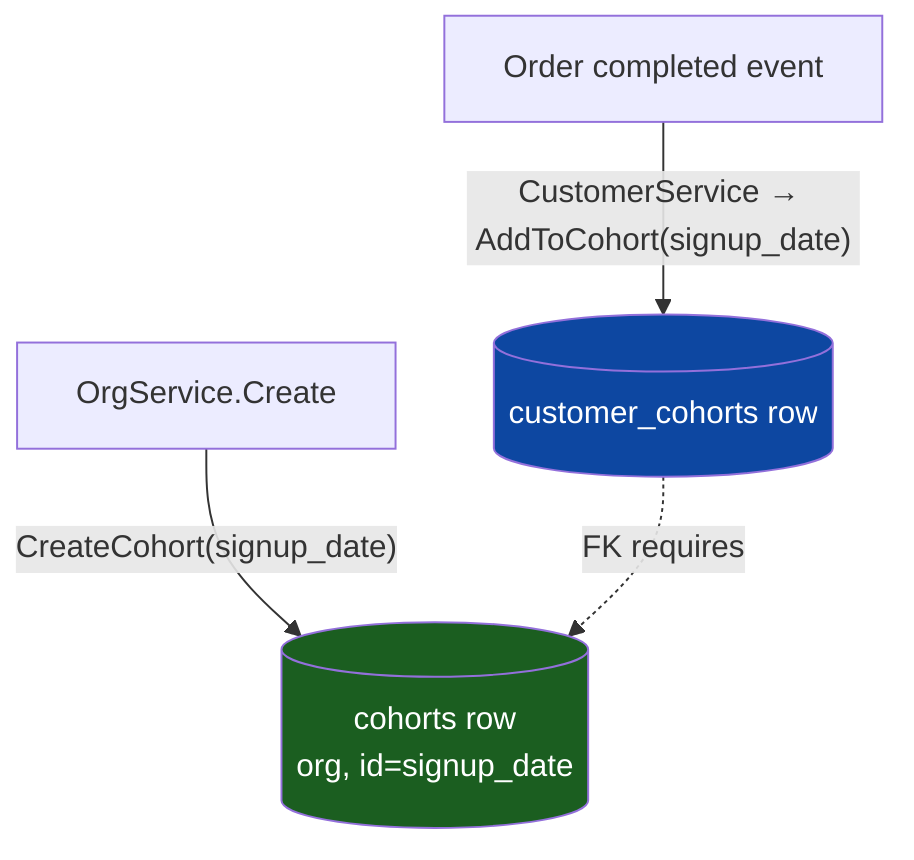

# Org seed data & the `customer_cohorts` FK error

## Symptom

The app logged (GORM format — see [logging.md](logging.md)):

```
ERROR: insert or update on table "customer_cohorts" violates foreign key constraint
"customer_cohorts_org_id_cohort_id_fkey" (SQLSTATE 23503)
INSERT INTO "customer_cohorts" (...,"cohort_id",...) VALUES (...,'signup_date',...)
```

## The constraint

`customer_cohorts` has a **composite FK** to `cohorts`:

```
customer_cohorts(org_id, cohort_id)  →  cohorts(org_id, id)   ON UPDATE CASCADE ON DELETE CASCADE
```

So you cannot insert a `customer_cohorts` row for `(org, 'signup_date')` unless a
`cohorts` row `(org, id='signup_date')` already exists.

## Who inserts what



- **The cohort parent is seeded in exactly one place:** `OrgService.Create`
  (`internal/core/service/org.go` — the `cohorts := []string{"signup_date"}` loop).
- **The child is written later**, on the `TopicOrderCompleted` event, by
  `CustomerService` (`internal/core/service/customer.go` → `AddToCohort`).

If the parent was never created, the child insert fails with the FK error above — minutes or
days after the org itself was created.

## Why the cohort was missing: **the org was inserted manually**

`orgRepository.Create` has exactly **one** caller — `OrgService.Create`. A manual
`INSERT INTO orgs (...)` (hand-seeded local data) **bypasses that service entirely**, so it skips
the two things the service seeds alongside the org row:

1. the API key (`api_keys`), and
2. the **`signup_date` cohort** (`cohorts`).

Tell-tale evidence in the local DB: the org row's `created_at` was hours **earlier** than its
`api_keys` rows — they didn't share a single `OrgService.Create` transaction, confirming the org
was created out-of-band.

### Fix applied

```sql
INSERT INTO cohorts (org_id, id, name, type, created_at, updated_at)
VALUES ('<org_id>', 'signup_date', 'signup_date', 'signup_date', now(), now())
ON CONFLICT (org_id, id) DO NOTHING;
```

## Seeding is fragile — known weaknesses

`OrgService.Create`'s cohort seeding is **best-effort**, not guaranteed:

- **Failure is swallowed** — a failed `CreateCohort` logs `Warn` and continues, so an org can
  exist (and be returned as success) without its cohort.
- **Not idempotent** — plain `Create`, so re-running errors on PK conflict.
- **Not transactional with the org row** — partial state is possible.
- **The consumer disagrees on criticality** — `AddToCohort` *hard-fails* if the cohort is missing,
  while the producer treats it as optional.

Hardening options (not yet applied): make `AddToCohort` upsert the cohort lazily, or promote the
seed failure to a hard error, or wrap org+key+cohort in one `TxManager` transaction.

## Full seed-data audit (per-org)

The authoritative definition of "required org bootstrap seed" is **what `OrgService.Create`
writes**: the `orgs` row, ≥1 `api_keys` row, and the `signup_date` `cohorts` row. Everything else
is created on demand or has a code-level fallback.

| Table | Required for a usable org? | Notes |
| --- | --- | --- |
| `api_keys` (≥1) | **yes** | seeded by `OrgService.Create` |
| `cohorts` (`signup_date`) | **yes** | seeded by `OrgService.Create`; the FK landmine above |
| `user_orgs` | no | **zero references in server Go code** — Clerk owns membership |
| `dunning_configurations` | no | `DunningService.ResolveConfig` falls back to `domain.DefaultDunningConfig()` |
| `gateways` + `settings` | **only to actually charge** | `GatewayFactory.NewGateway` needs both a `gateways` row **and** a `settings` row; without them every billing attempt errors. Not bootstrap seed — configured by connecting a PSP |
| `customer_cohorts`, `carts`, `orders`, `subscriptions`, `payments`, `refunds`, `dunning_*`, `webhook_subscriptions`, `sessions`, `metadata_store` | no | populated on demand by normal flows |

### Practical implication for hand-seeded test orgs

A manually-inserted org needs, at minimum: **≥1 api_key** + the **`signup_date` cohort**. To
exercise **billing end-to-end** it also needs a **PSP `gateways` + `settings`** pair — otherwise
`billing-cycle` errors when it tries to construct a gateway, which (see
[durable-runner-timeouts.md](durable-runner-timeouts.md)) is fatal to the subscription runner.
