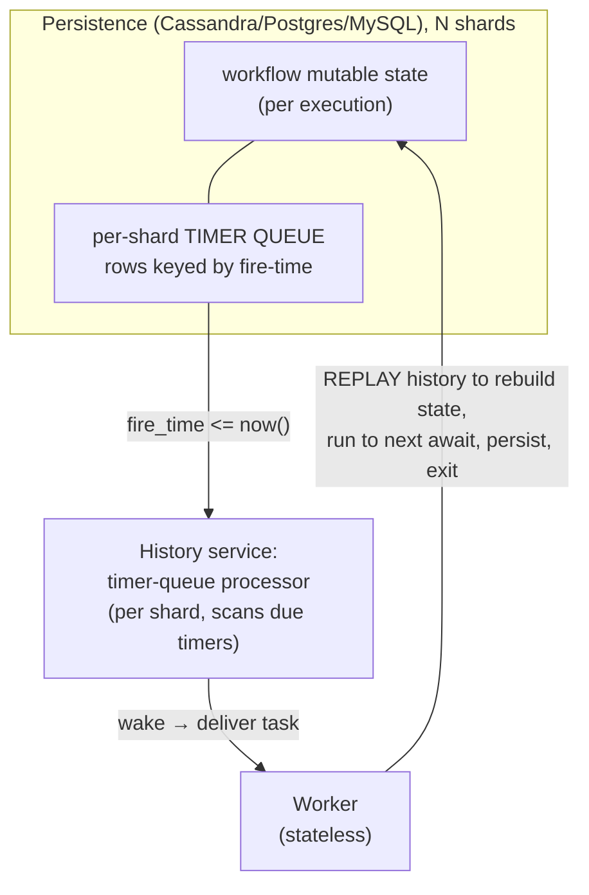
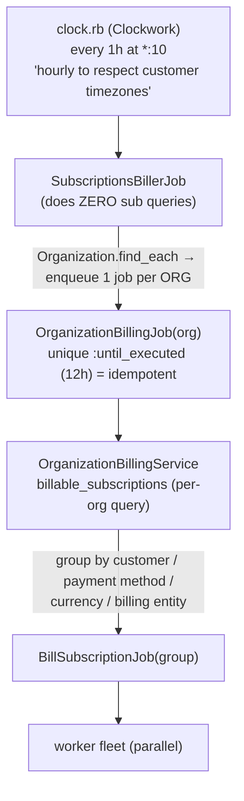
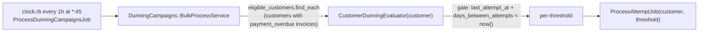
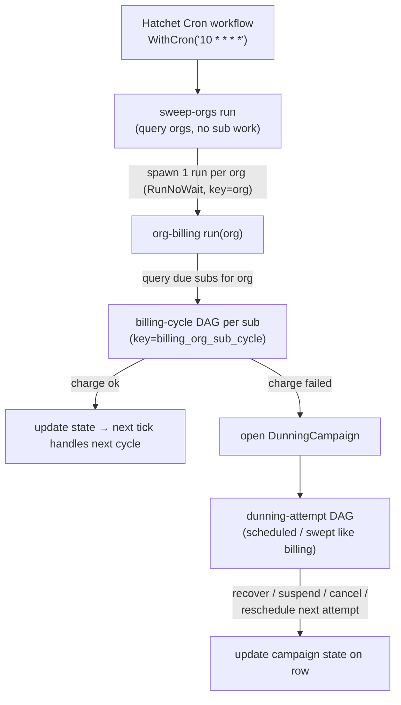

# How to actually run subscriptions (and dunning) on a workflow engine

> Companion to [durable-runner-timeouts.md](durable-runner-timeouts.md). That doc explains the
> bug; this one explains the **architecture** — the three execution models, why the current code
> is shaped for Temporal not Hatchet, and how a real multitenant billing system (Lago) does it.
> Lago findings are **source-verified** against a fresh clone of `getlago/lago-api` (2026-06-03).

## The one-paragraph version

Recurring billing is fundamentally a **"what is due to run right now?"** problem over a huge,
multitenant set. There are three ways to solve it, and they're the same algorithm with the
fire-time index in different places: (1) **Temporal durable timers** — the engine keeps a
persisted, sharded timer queue and wakes one workflow when its timer fires; (2) **Hatchet
long-running durable task** — one task sleeps for the whole interval (this is what our code does;
it works **only if you opt into eviction** so the task is evicted during the sleep and resumes with
a fresh deadline — our code sets no eviction policy, so it's reaped after 5 min, see the timeout
doc); (3) **cron + fan-out** — a periodic sweep, sharded by tenant, that enqueues work for whatever
is due (this is what Lago does in production). Our `subscription-runner` and `dunning-runner` are
written in style (2) but **mis-configured** (no eviction policy, non-replay-safe side-effects);
they should either be fixed (eviction + idempotent steps) or moved to style (3) — or run on
Temporal. All three are viable; the choice is granularity-vs-simplicity, not "one works."

---

## 1. Temporal: the "long-running actor" is an illusion — it's cron underneath

The current `subscription-runner` reads as: *one durable workflow per subscription that sleeps for
30/365 days and loops forever, reacting to events.* That's the **Temporal actor model**, and it's
legitimate **on Temporal** — but not because a goroutine sleeps for a year. Under the hood Temporal
is doing the same sharded "what's due now" scan a cron does:

Key facts that make it scale (and that demystify the "actor"):

- **The workflow is not resident in memory while it sleeps.** When a workflow hits
  `workflow.Sleep(365 days)` (or `Await`), the worker persists its state and **the goroutine goes
  away**. A row is written to a **per-shard timer queue** keyed by fire-time.
- **A timer-queue processor per shard** repeatedly asks the DB "which timers in my shard are due
  now?" — an indexed scan, `O(due)` not `O(total)`. **That is a cron sweep**, just internal to the
  engine and sharded across many history shards so no single scan is hot.
- When a timer fires (or a signal arrives), the engine schedules a **workflow task**; a stateless
  worker picks it up, **replays the event history** to rebuild in-memory state deterministically,
  runs forward to the next `await`, persists, and exits again.
- **Durability = the persisted history**, not a live process. Worker restarts are invisible: the
  next task just replays on another worker.
- **`ContinueAsNew`** is how Temporal keeps a "forever" loop healthy: when history grows large
  (many cycles), the workflow restarts itself with a fresh, empty history carrying forward only the
  state it needs. Without it, an infinitely-looping subscription workflow would accumulate unbounded
  history. **Our runner does not call ContinueAsNew — on Temporal that's a latent issue for very
  long-lived subscriptions.**

So: **"long-running actor" on Temporal *is* cron-on-their-side** — a sharded, fire-time-indexed
timer queue with replay-based actors woken on demand. Temporal's value is that it hides the sweep
and the state-rehydration behind a clean imperative API.

### How Hatchet does the same thing — eviction (opt-in), not automatic

Hatchet *can* evaporate-and-rehydrate like Temporal, but **only if you opt into eviction**. By
default a durable wait holds a single in-memory execution bounded by one `timeout_at` (default
**5 minutes**, never reset across the loop). That's why our runner — which sets **no eviction
policy** — is reaped in 5 minutes: it never gets evicted, so it just blocks until the timeout kills
it.

With `WithEvictionPolicy{TTL, AllowCapacityEviction}` (exists in our pinned v0.86.5), a task whose
wait exceeds the TTL is **evicted** (slot freed, state persisted) and **re-assigned with a fresh
`timeout_at`** when the sleep fires — the same evaporate/rehydrate Temporal does automatically.
Config: `WithEvictionPolicy(TTL ≈ 30s)` + `WithExecutionTimeout(few minutes > TTL)`. Then the
year-long sleep survives and the loop runs forever.

**Two strings attached** — and the second one is fatal for an *infinite* loop:
1. **Replay-from-top.** On resume, Hatchet replays the function; durable ops (`WaitFor`, child
   `client.Run`, `ctx.Now`) return cached results, but **plain code re-executes**
   (`pkg/worker/context.go:1016`). Every side-effect must be a durable child task or idempotent —
   our runner's `HandleSubscriptionChargeSuccess/Failure` + pubsub are plain calls and are **not**
   replay-safe today. (Cold resume after a redeploy also re-walks all prior steps from `node_id=0`,
   so step count ≈ replay cost.)
2. **Retention is partition-by-creation-date, and eviction does NOT help (verified).** The durable
   event log (`v1_durable_event_log_{file,entry,branch_point}`) is
   `PARTITION BY RANGE(durable_task_inserted_at)`, and `RetentionController` drops whole partitions
   older than the tenant's retention window. A bounded task's log lives in its birth-date partition
   and drops cleanly once it completes + ages out. An **immortal** per-subscription loop is **still
   running** when its birth-date partition crosses the retention horizon — and retention is
   **liveness-blind** (partitions are selected by the date in their name only, then `DETACH … + DROP
   TABLE` unconditionally; `pkg/repository/task.go:352-411`). So the GC **deletes the live task's
   durable log mid-flight** — it does not linger. The task is then orphaned: replay reads find
   nothing, and new durable writes have no partition to land in (no DEFAULT partition) →
   `no partition of relation found`. **A `SleepFor(365d)` is only one log entry — duration is cheap;
   the problem is the task never completing before retention reaps its partition.** Eviction fixes
   the *timeout* but is orthogonal to this. So the `for { charge; SleepFor }` shape is wrong on
   Hatchet regardless of eviction.

So the current code is **Temporal-idiomatic but structurally wrong for Hatchet as an infinite loop**.
The fix is **not** "eviction"; it's **one short durable task per renewal** (cron/self-reschedule
drives it) so each run completes and its partition ages out — plus replay-safe side-effects. Dunning,
being bounded, stays a single durable task (it just needs eviction for its multi-day waits).

---

## 2. Lago: the production cron + fan-out model (source-verified)

Lago is multitenant billing at scale and uses **no per-subscription durable runner at all**. It's a
3-level fan-out off an hourly clock, **sharded by organization**.

Verified specifics:

- **The clock job touches no subscriptions** — `SubscriptionsBillerJob` is literally
  `Organization.find_each { |org| OrganizationBillingJob.perform_later(org) }`. **The tenant is the
  shard.** A whale org runs in its own job(s) and can't head-of-line-block other tenants. Lago even
  has `DedicatedWorkerConfig` to pin big orgs to dedicated workers.
- **Recurrence is derived, not stored-and-swept.** `billable_subscriptions` is a `UNION` of
  date-predicate scopes per `(billing_time × interval)` — e.g. `monthly_calendar`:
  `DATE_PART('day', today)=1`; `monthly_anniversary`: today's day-of-month = `subscription_at`'s
  day-of-month (with `generate_series` for 28–31-day months); `yearly_anniversary`: month+day match
  with Feb 28/29 leap handling. All scoped `WHERE organizations.id = ... AND status = active`.
- **Idempotency at two layers**: `unique :until_executed` on the per-org job + an
  `already_billed_today` CTE that excludes subs already invoiced today. Re-running the same hour
  never double-bills.
- **Cadence is coarse (hourly)** — deliberately, so each customer's local-midnight boundary is
  caught in their timezone. Recurring charges fire on a tick boundary, not to-the-second.

### Lago dunning — the SAME pattern, on the same clock

- Dunning is **not** a per-campaign sleeping runner. The "wait N days between attempts" is
  implemented as a **stateful date gate** — `days_between_attempts_satisfied?` checks
  `last_dunning_campaign_attempt_at + days_between_attempts.days < now`, evaluated **every hourly
  tick**. No sleep.
- **State lives on the row**: `dunning_currency_attempts` (count per currency) and
  `last_dunning_campaign_attempt_at` on the customer, updated each attempt. Terminal when
  `all max_attempts reached` → `dunning_campaign.finished` webhook.

**Takeaway:** billing and dunning are the *same* problem — "periodic, stateful, fan-out by tenant" —
and Lago solves both with one mechanism: hourly sweep + date-gate + fan-out + state-on-the-row +
idempotency. No long-lived workflow objects anywhere.

---

## 3. Mapping it onto Hatchet (and where dunning fits)

Hatchet is built for exactly the fan-out model. The cron + per-tenant fan-out maps 1:1, and every
fanned-out run keeps Hatchet's strengths:

### "Does this mean each run is durable and retried?" — yes

Every Hatchet **task run is durable** (persisted; survives worker restart — a crashed run is
re-dispatched) and has **independent retry config**. The existing `billing-cycle` already sets
`WithRetries(50)` + `WithRetryBackoff(1.2, 600s)` and a `60s` execution timeout — that's correct for
a **short** unit of work. In the fan-out model each per-sub charge is one such short, durable,
retried run. You keep:

- **Durability** — a worker dying mid-charge re-runs the task; the run key
  (`billing_<org>__<cycle>`) makes it idempotent so no double-charge.
- **Retries/backoff** — transient PSP/DB failures retry automatically.
- **Observability** — one run per charge, filterable by the `orgId`/`subscriptionId` metadata we
  added (see [run-metadata.md](run-metadata.md)).

The ONLY thing you give up vs. the durable-actor style is the long-lived per-subscription object
that you signal while it sleeps. In the fan-out model **the DB is the source of truth** and each
short run reads current state — which is simpler and is exactly why pause/cancel "just work" (a
paused sub is simply not selected by the next sweep).

### "Where does dunning fit? Next-run schedule, then a DAG that updates state? Same principles?"

**Yes — identical principles.** Dunning is just "billing with a different cadence and a state
machine":

| | Normal billing | Dunning |
| --- | --- | --- |
| Trigger | sub is due this tick (interval + anchor) | campaign attempt is due this tick (`last_attempt_at + backoff < now`) |
| Unit of work | `billing-cycle` DAG (charge once) | `dunning-attempt` DAG (retry once) |
| State | `next_charge_at` / `cycles_processed` on the sub | attempt count, `last_attempt_at`, phase on the campaign |
| Outcome | success → advance cycle; fail → open campaign | recover → close; exhausted → suspend/cancel; else → reschedule next attempt |
| Selection | swept per tick, fanned out by tenant | swept per tick, fanned out by tenant |

So the flow you described is right: a charge failure opens a `DunningCampaign`; thereafter each
**due** attempt runs the `dunning-attempt` DAG (which we already have — one `execute-attempt` task),
and `DunningService.UpdateCampaignWithAttemptResult` applies the escalation policy and writes the
next state (recover / suspend / cancel / next-attempt-at). The campaign's "wait 3 days between
progressive attempts" becomes a **date gate checked each tick**, not a 3-day in-memory sleep.

> **Important:** our current `dunning-runner` is the **same Temporal-style long-running durable
> task** as `subscription-runner` — it `WaitFor(SleepCondition(...))` up to **3 days** in the
> progressive phase with **no execution timeout**, so it has the **identical 5-minute-reap bug**.
> Whatever we decide for subscriptions must be applied to dunning too — they share the shape.

---

## 4. Decision: three viable end states (the infinite-loop option is now ruled out)

> **Ruled out — infinite per-sub durable loop + eviction (my earlier "B2").** Verified dead: even
> with eviction solving the timeout, an immortal task fights the creation-time-partitioned retention
> model (§1). Don't do `for { charge; SleepFor(interval) }` on Hatchet.

| Option | What it is | Pros | Cons |
| --- | --- | --- | --- |
| **A. Subscriptions + dunning on Temporal** | run the existing durable actors on `WORKFLOW_ENGINE=temporal` | least code change; current code is ~Temporal-correct | must add `ContinueAsNew` for long-lived history; Temporal must be operated; Hatchet path stays broken |
| **B. Cron + fan-out on Hatchet (Lago model)** ⭐ | hourly Hatchet cron → per-org runs → **one fresh `billing-cycle` durable task per due sub**; dunning gated the same way; state on the row | one engine; proven multitenant pattern; each task completes → partition ages out cleanly; no timeout/replay/retention trap; reuses existing DAGs + idempotent keys | rewrite the runners as sweepers; coarser (tick-bounded) cadence; lose signal-a-running-workflow |
| **C. Per-sub self-rescheduling (Hatchet Schedules)** | each renewal task ends by `client.Schedules().Create(TriggerAt: next)` then **exits** | keeps per-sub granularity; each run is bounded → ages out cleanly; fresh timeout | many persisted schedule rows; must cancel/reschedule on pause/plan-change; more lifecycle edge cases |

Both **B** and **C** share the load-bearing property: **each renewal is a fresh, short, completing
durable task** (own birth-date partition → cleanly dropped). They differ only in what triggers the
next one (a swept cron vs. a per-entity schedule). **Dunning** in either case stays **one bounded
durable task per campaign** + an eviction policy for its multi-day waits.

**Recommendation:** **B** if we want one engine and bulletproof multitenant scaling (it's what a
production peer actually ships, and it satisfies the retention model by construction). **C** if we
want to keep per-subscription granularity without a global sweep, accepting schedule-lifecycle
complexity. **A** if we'd rather not rewrite now and are willing to run Temporal (verify
`ContinueAsNew` first). **Lean B.**

Note the split: **subscriptions** must stop being an immortal loop (→ fresh task per renewal);
**dunning** can stay a single bounded durable task per campaign and just needs an eviction policy for
its multi-day waits. They do **not** get the same treatment.

## Immediate vs. strategic

- **Now (local dev unblock only):** bump `WithExecutionTimeout` on `subscription-runner` above the
  longest sleep (annual ⇒ ~400d) **and** seed a PSP gateway, so the current code runs end-to-end on
  Hatchet for a smoke test. This is a throwaway stopgap — the immortal loop still fights retention
  (timeout doc), so it is **not** a path to production.
- **Strategic:** subscriptions → **B** (cron → fresh per-renewal task); dunning → bounded durable
  task **+ eviction policy**. See the Fix-options section of the timeout doc for the concrete edits.
