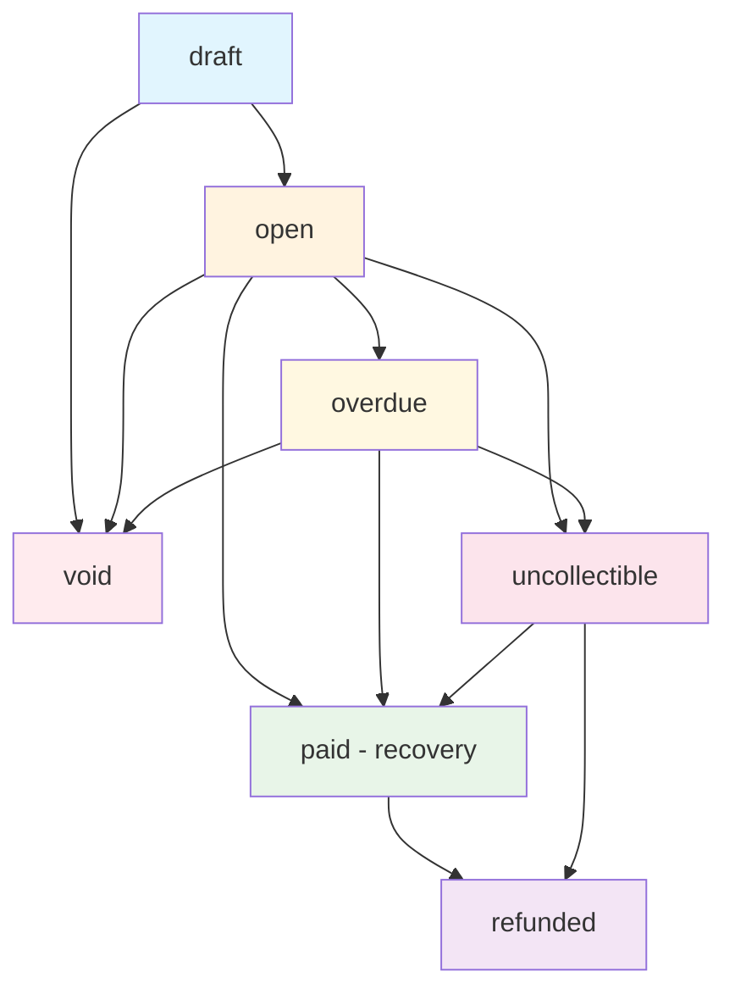

# Invoice States and Transitions

## Overview

This document outlines the invoice status model, state transitions, and business rules for the Payloop billing system. The model is designed to align with industry standards (particularly Stripe) while leveraging our existing `IsImmutable` field for editability control.

## Invoice Status Definitions

### Core Statuses

| Status | Description | Payable | Editable | Notes |
|--------|-------------|---------|----------|-------|
| `draft` | Invoice being prepared | ❌ | ✅ (when IsImmutable=false) | Default status for new invoices |
| `open` | Finalized, awaiting payment | ✅ | ❌ | Invoice is immutable and ready for payment |
| `paid` | Fully paid | ❌ | ❌ | Final success state |
| `overdue` | Past due date | ✅ | ❌ | Still payable but past due |
| `void` | Voided/cancelled | ❌ | ❌ | Cannot be paid or modified |
| `uncollectible` | Marked as bad debt | ✅ | ❌ | Bad debt but may still be recoverable |
| `refunded` | Refunded via credit notes | ❌ | ❌ | Final refund state |

### Status Details

#### `draft`
- **Purpose**: Invoice is being prepared and may be modified
- **Editability**: Controlled by `IsImmutable` field
  - `IsImmutable=false`: Can add/remove line items, change amounts
  - `IsImmutable=true`: Content locked but not yet finalized
- **Next States**: `open`, `void`

#### `open` (replaces `sent`)
- **Purpose**: Finalized invoice awaiting payment
- **Key Properties**: Always `IsImmutable=true`
- **Payment Window**: Can accept payments until status changes
- **Next States**: `paid`, `overdue`, `void`, `uncollectible`

#### `paid`
- **Purpose**: Invoice fully paid
- **Triggers**: When `AmountPaid >= Total`
- **Finality**: Terminal state (can only go to `refunded`)
- **Next States**: `refunded`

#### `overdue`
- **Purpose**: Past due date but still payable
- **Auto-transition**: System can auto-transition from `open` based on `DueAt`
- **Recovery**: Can still be paid (transitions to `paid`)
- **Next States**: `paid`, `void`, `uncollectible`

#### `void` (replaces `cancelled`)
- **Purpose**: Invoice cancelled/voided by business
- **Use Cases**: Order cancelled, pricing error, duplicate invoice
- **Finality**: Terminal state, cannot be paid or modified
- **Timestamp**: `VoidedAt` records when voided

#### `uncollectible`
- **Purpose**: Marked as bad debt
- **Recovery**: Still allows payments (customer may pay later)
- **Accounting**: Can be written off as bad debt
- **Next States**: `paid`, `refunded`
- **Timestamp**: `MarkedUncollectibleAt` records when marked

#### `refunded`
- **Purpose**: Invoice refunded via credit notes
- **Trigger**: Credit notes issued covering full amount
- **Finality**: Terminal state
- **Accounting**: Original payment reversed

## State Transition Diagram



## IsImmutable Field Usage

The `IsImmutable` field controls whether invoice content can be modified:

- **`false`**: Invoice content can be changed (line items, amounts, etc.)
- **`true`**: Invoice content is locked, no modifications allowed

### Relationship with Status

| Status | IsImmutable | Reasoning |
|--------|-------------|-----------|
| `draft` | `false` or `true` | Flexible - can be locked before finalization |
| `open` | `true` | Always immutable once finalized |
| `paid` | `true` | Always immutable |
| `overdue` | `true` | Always immutable |
| `void` | `true` | Always immutable |
| `uncollectible` | `true` | Always immutable |
| `refunded` | `true` | Always immutable |

## Timestamp Fields

### Purpose and Usage

| Field | Purpose | Set When | Used For |
|-------|---------|----------|----------|
| `IssuedAt` | When invoice was issued | Status → `open` | Display, reporting |
| `DueAt` | Payment due date | Invoice creation | Overdue detection |
| `PaidAt` | When payment received | Status → `paid` | Accounting, reporting |
| `DeliveredAt` | When emailed to customer | Email sent | Delivery tracking |
| `VoidedAt` | When voided | Status → `void` | Audit trail |
| `MarkedUncollectibleAt` | When marked bad debt | Status → `uncollectible` | Accounting, reporting |

### Email Delivery vs Finalization

**Previous Model**: `sent` status conflated finalization with delivery
**New Model**: Separate concerns:
- `Status = open`: Invoice is finalized
- `DeliveredAt`: Tracks email delivery separately

## Business Rules

### Payment Rules

```go
// Can accept payments
func (i *Invoice) IsPayable() bool {
    return i.Status == InvoiceStatusOpen || 
           i.Status == InvoiceStatusOverdue || 
           i.Status == InvoiceStatusUncollectible
}
```

### Void Rules

```go
// Can be voided
func (i *Invoice) CanVoid() bool {
    return i.Status == InvoiceStatusOpen || 
           i.Status == InvoiceStatusOverdue || 
           i.Status == InvoiceStatusUncollectible
}
```

### Bad Debt Rules

```go
// Can mark as uncollectible
func (i *Invoice) CanMarkUncollectible() bool {
    return i.Status == InvoiceStatusOpen || 
           i.Status == InvoiceStatusOverdue
}
```

## API Implications

### Endpoint Behavior by Status

| Endpoint | `draft` | `open` | `paid` | `overdue` | `void` | `uncollectible` | `refunded` |
|----------|---------|--------|--------|-----------|--------|----------------|-----------|
| `PUT /invoices/{id}` | ✅* | ❌ | ❌ | ❌ | ❌ | ❌ | ❌ |
| `POST /invoices/{id}/finalize` | ✅ | ❌ | ❌ | ❌ | ❌ | ❌ | ❌ |
| `POST /invoices/{id}/send` | ❌ | ✅ | ❌ | ✅ | ❌ | ✅ | ❌ |
| `POST /invoices/{id}/pay` | ❌ | ✅ | ❌ | ✅ | ❌ | ✅ | ❌ |
| `POST /invoices/{id}/void` | ✅ | ✅ | ❌ | ✅ | ❌ | ✅ | ❌ |
| `POST /invoices/{id}/mark_uncollectible` | ❌ | ✅ | ❌ | ✅ | ❌ | ❌ | ❌ |

*Only when `IsImmutable=false`

### New Endpoints to Add

- `POST /invoices/{id}/void` - Void an invoice
- `POST /invoices/{id}/mark_uncollectible` - Mark as bad debt
- `POST /invoices/{id}/finalize` - Finalize draft (draft → open)

## Webhook Events

### Event Types

| Event | Triggered When | Data Included |
|-------|----------------|---------------|
| `invoice.finalized` | `draft` → `open` | Full invoice object |
| `invoice.sent` | Email delivered | Invoice + delivery info |
| `invoice.paid` | Payment received | Invoice + payment info |
| `invoice.overdue` | Past due date | Invoice object |
| `invoice.voided` | Invoice voided | Invoice + void reason |
| `invoice.marked_uncollectible` | Marked bad debt | Invoice object |
| `invoice.payment_recovered` | `uncollectible` → `paid` | Invoice + payment info |

### Backward Compatibility

For existing webhook consumers expecting `invoice.sent`:
- Continue sending `invoice.sent` when `DeliveredAt` is set
- Add new `invoice.finalized` for status transitions

## Migration Strategy

### Database Migration

1. **Add new enum values** to `InvoiceStatus`
2. **Add timestamp columns** (`delivered_at`, `voided_at`, `marked_uncollectible_at`)
3. **Data migration**:
   - `sent` → `open` 
   - `cancelled` → `void`
   - Set `delivered_at = issued_at` for existing `sent` invoices

### Code Migration

1. **Update constants** in domain entities
2. **Add business methods** for new status checks
3. **Update all status references** throughout codebase
4. **Add new API endpoints** for void/mark_uncollectible
5. **Update tests** for new status values

### Deployment Strategy

1. **Phase 1**: Deploy schema changes (backward compatible)
2. **Phase 2**: Deploy code changes with feature flags
3. **Phase 3**: Run data migration scripts
4. **Phase 4**: Enable new features, deprecate old endpoints

## Testing Strategy

### Unit Tests

- [ ] Invoice business methods (`IsPayable`, `CanVoid`, etc.)
- [ ] State transition validation
- [ ] Timestamp field updates

### Integration Tests

- [ ] API endpoint behavior by status
- [ ] Webhook event firing
- [ ] Email delivery tracking

### End-to-End Tests

- [ ] Complete invoice lifecycle
- [ ] Payment processing by status
- [ ] Recovery scenarios (uncollectible → paid)

## Conclusion

This enhanced status model provides:

1. **Industry Alignment**: Matches Stripe and other major billing systems
2. **Clear Separation**: Finalization vs delivery concerns
3. **Flexible Recovery**: Bad debt can still be collected
4. **Comprehensive Tracking**: Timestamps for all state changes
5. **Backward Compatibility**: Smooth migration path from existing system

The model leverages the existing `IsImmutable` field while providing clearer semantics for payment processing and customer communication.