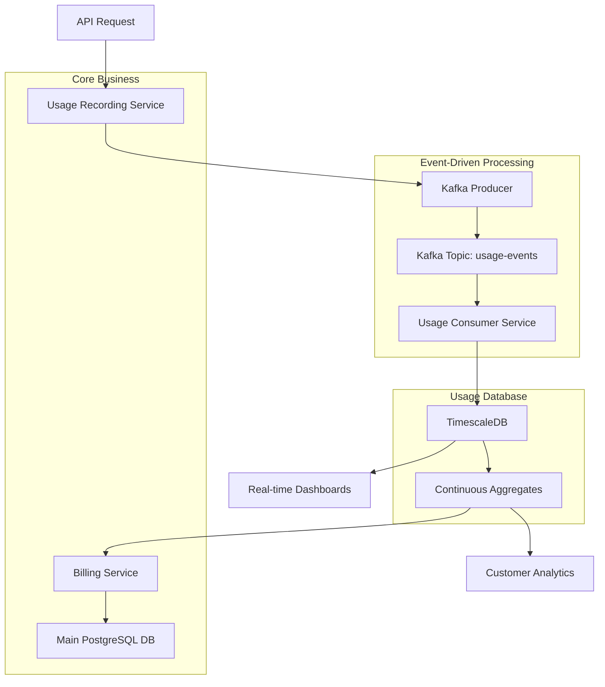
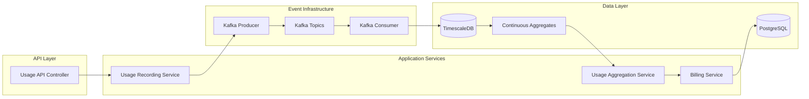
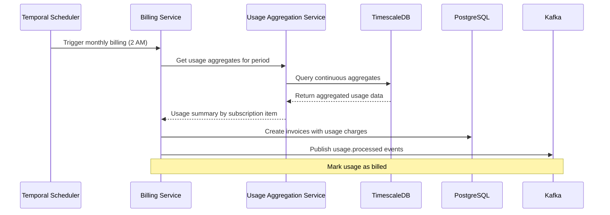

# Usage-Based Billing Architecture

## Overview

This document describes the implementation of a high-performance, event-driven architecture for usage-based billing that separates high-volume usage recording from core business operations while maintaining data consistency through event sourcing and continuous aggregations.

## Architecture Goals

- **High Throughput**: Handle millions of usage events per second
- **Logical Separation**: Isolate usage data from core business operations  
- **Billing Accuracy**: Ensure eventual consistency with 2-hour settlement window
- **Real-time Analytics**: Support near real-time usage dashboards
- **Scalability**: Independent scaling of usage recording and billing systems

## System Architecture

### High-Level Data Flow



### Component Architecture



## Database Architecture

### TimescaleDB (Usage Database)

**Purpose**: High-volume usage event storage and time-series analytics
**Port**: 5433
**Database**: `payloop_usage`

#### Schema Structure

```sql
-- Main usage events hypertable
CREATE TABLE usage_events (
    time TIMESTAMPTZ NOT NULL,              -- Partition key
    org_id TEXT NOT NULL,                   -- Multi-tenancy
    subscription_id TEXT NOT NULL,
    subscription_item_id TEXT NOT NULL,
    customer_id TEXT NOT NULL,
    usage_type TEXT NOT NULL,               -- "unit", "percentage", "hybrid"
    quantity NUMERIC(15, 4),                -- For unit-based usage
    transaction_value BIGINT,               -- For percentage-based usage
    calculated_amount BIGINT NOT NULL,      -- Final amount in cents
    reference_id TEXT,                      -- Idempotency
    metadata JSONB,
    PRIMARY KEY (org_id, subscription_item_id, time)
);

-- Convert to hypertable with daily partitioning
SELECT create_hypertable('usage_events', 'time', 
    chunk_time_interval => INTERVAL '1 day');
```

#### Continuous Aggregates

**Hourly Aggregates** (Real-time dashboards):
```sql
CREATE MATERIALIZED VIEW usage_hourly
WITH (timescaledb.continuous) AS
SELECT 
    time_bucket('1 hour', time) AS hour,
    org_id, subscription_item_id, usage_type,
    SUM(quantity) as total_quantity,
    SUM(calculated_amount) as total_amount,
    COUNT(*) as event_count
FROM usage_events
GROUP BY hour, org_id, subscription_item_id, usage_type;
```

**Daily Billing Aggregates** (Monthly billing):
```sql
CREATE MATERIALIZED VIEW usage_daily_billing
WITH (timescaledb.continuous) AS
SELECT 
    time_bucket('1 day', time) AS day,
    org_id, subscription_id, subscription_item_id,
    date_trunc('month', time) as billing_period,
    SUM(quantity) as daily_quantity,
    SUM(calculated_amount) as daily_amount,
    COUNT(*) as daily_events
FROM usage_events
GROUP BY day, org_id, subscription_id, subscription_item_id, billing_period;
```

### PostgreSQL (Main Database)

**Purpose**: Core business logic, subscriptions, invoices, customers
**Port**: 5432
**Database**: `payloop`

The main database schema remains unchanged except for the removal of the `usage_records` table and its foreign key relationships.

## Event-Driven Processing

### Event Schema

```json
{
  "event_id": "uuid",
  "event_type": "usage.recorded",
  "timestamp": "2024-01-15T10:30:00Z",
  "org_id": "org_123",
  "subscription_id": "sub_456", 
  "subscription_item_id": "item_789",
  "customer_id": "cust_012",
  "usage_type": "unit",
  "quantity": 100.0,
  "calculated_amount": 5000,
  "reference_id": "api_call_xyz",
  "metadata": {}
}
```

### Kafka Topics

- **usage-events**: Primary stream for all usage events
- **usage-processed**: Events when usage is included in billing
- **usage-corrections**: Events for usage adjustments and refunds

### Processing Flow

1. **Usage Recording**: API → Kafka Producer → `usage-events` topic
2. **Event Storage**: Kafka Consumer → TimescaleDB insertion
3. **Real-time Aggregation**: Continuous aggregates refresh every 5 minutes
4. **Billing Processing**: Scheduled job queries finalized aggregates at 2 AM

## Billing Integration

### Monthly Billing Workflow



### Billing Period Processing

1. **Grace Period**: Wait 2 hours after midnight for event settlement
2. **Aggregate Refresh**: Ensure all continuous aggregates are current
3. **Data Retrieval**: Query monthly aggregates from TimescaleDB
4. **Invoice Creation**: Create invoices in main database with usage line items
5. **Status Update**: Mark usage as processed via Kafka events

# Aggregate-First Usage Billing Design Guidelines

## Core Concept

The aggregate-first approach separates **what happened** from **what it costs**. Raw usage events are collected and stored without any pricing information, then aggregated and priced only when generating invoices. This creates a clear boundary between usage tracking and financial calculations.

## The Two-Stage Process

### Stage 1: Raw Event Collection
Capture pure usage data as events occur, recording only the operational facts:
- What service was used
- How much was consumed
- When it happened
- Who used it

### Stage 2: Invoice-Time Aggregation and Pricing
When generating an invoice:
1. Query all raw events for the billing period
2. Aggregate usage according to billing requirements
3. Apply current pricing rules to aggregated totals
4. Generate final invoice line items

## Usage Pattern Examples

### Simple Consumption Billing
**Use Case**: API calls, storage bytes, bandwidth usage

**Aggregation Pattern**: Sum total usage across the billing period
- Raw events: Individual API calls with request counts
- Aggregation: Total API calls per month
- Pricing: Apply tiered pricing to total volume

**Example**: A customer makes 1.2 million API calls. Aggregate to monthly total, then apply pricing tiers (first 100k free, next 900k at $0.01 each, remainder at $0.005 each).

### Time-Based Usage
**Use Case**: Compute hours, seat licenses, service uptime

**Aggregation Pattern**: Calculate duration or time-based metrics
- Raw events: Service start/stop events with timestamps
- Aggregation: Total active hours per billing period
- Pricing: Apply hourly rates with potential volume discounts

**Example**: A virtual server runs for varying durations throughout the month. Aggregate total runtime hours, then apply hourly pricing with discounts for high usage.

### Peak Usage Billing
**Use Case**: Maximum concurrent users, peak bandwidth, highest storage

**Aggregation Pattern**: Find maximum values during billing period
- Raw events: Point-in-time usage measurements
- Aggregation: Identify peak usage levels
- Pricing: Bill based on highest consumption point

**Example**: A customer's storage usage fluctuates daily. Find the highest storage amount used during the month and bill based on that peak level.

### Feature-Based Usage
**Use Case**: Premium features, add-on services, per-transaction fees

**Aggregation Pattern**: Count feature usage events and categorize
- Raw events: Feature activation events with context
- Aggregation: Count usage by feature type
- Pricing: Apply different rates per feature category

**Example**: A customer uses basic search (unlimited) and AI-powered search (premium). Count AI search uses separately and apply premium pricing only to those transactions.

### Graduated Pricing Models
**Use Case**: Progressive tiers, volume discounts, usage commitments

**Aggregation Pattern**: Accumulate usage and apply complex pricing logic
- Raw events: Individual usage instances
- Aggregation: Running totals with tier tracking
- Pricing: Apply graduated rates as usage crosses thresholds

**Example**: Email sending service with tiers: first 10k emails at $0.10 each, next 40k at $0.08 each, above 50k at $0.05 each. Aggregate total emails sent, then calculate cost across all applicable tiers.

### Mixed Billing Models
**Use Case**: Base subscription plus usage overages

**Aggregation Pattern**: Combine different aggregation methods
- Raw events: All usage activities
- Aggregation: Multiple aggregation types (sums, peaks, counts)
- Pricing: Apply base rates plus overage calculations

**Example**: A customer has a plan with 1000 included API calls and 10GB included storage. Aggregate API calls and storage separately, calculate overages beyond included amounts, and add to base subscription fee.

## Design Benefits

### Pricing Flexibility
- Change pricing models without touching historical usage data
- Implement complex pricing retroactively
- Test different pricing strategies on the same usage data

### Operational Clarity
- Clear audit trail from raw events to final charges
- Ability to explain any charge by tracing back to source events
- Simplified dispute resolution with transparent calculations

### System Scalability
- Raw events can be optimized for high-volume ingestion
- Pricing calculations only run during invoice generation
- Can implement different storage strategies for hot and cold data

### Business Adaptability
- Support multiple billing cycles for the same usage data
- Handle plan changes mid-cycle without data migration
- Enable pro-rating and partial period billing

## Key Considerations

### Data Retention Strategy
Plan for storing raw events longer than processed invoices to support auditing, disputes, and pricing model changes.

### Performance Management
Design aggregation queries to handle your expected usage volumes efficiently, considering indexing strategies and query optimization.

### Pricing Rule Management
Maintain clear versioning and effective dating of pricing rules to ensure consistent invoice generation over time.

### Edge Case Handling
Consider scenarios like partial periods, plan changes, refunds, and adjustments in your aggregation logic.

## Implementation Philosophy

The aggregate-first approach treats usage data as an immutable historical record and pricing as a flexible business rule applied to that record. This separation enables billing systems that can evolve with changing business requirements while maintaining data integrity and audit capabilities.

The key is to capture usage events with sufficient detail to support any future pricing model, then design aggregation logic that can transform that raw data into the specific metrics needed for your billing approach.

