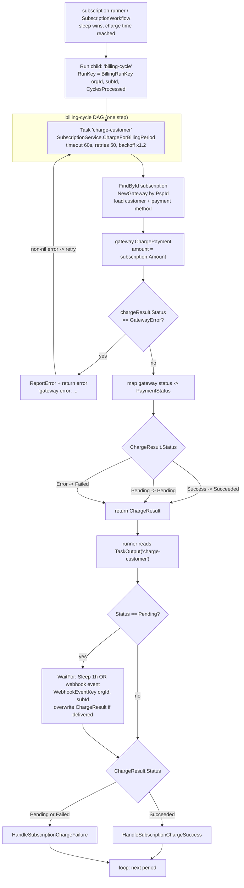
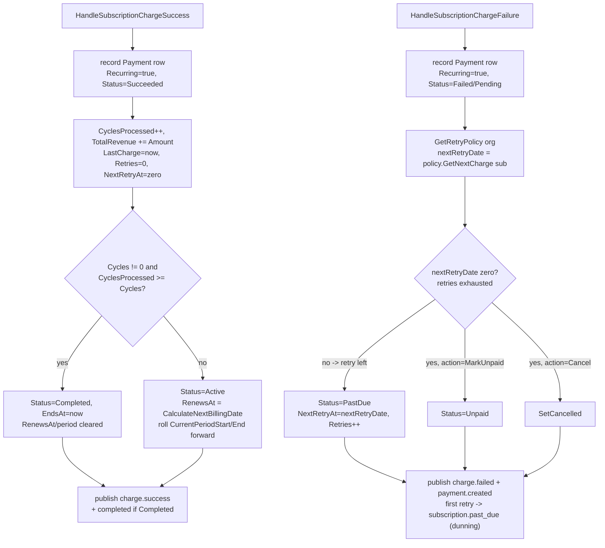

# Billing Cycle (Charge a Period)

The billing-cycle workflow runs exactly one gateway charge for a subscription's current period. It is a strictly synchronous one-step DAG (`charge-customer`) spawned by the per-subscription runner; the runner inspects the returned `ChargeResult`, optionally waits for a webhook when the charge is `Pending`, and then applies the result. Computing the amount, invoking the gateway, recording the payment, and advancing the next-billing-date all live in `SubscriptionService` so the Hatchet and Temporal adapters stay paper-thin and behave identically.

The single DAG step has effectively unlimited retries with long backoff so transient gateway errors (e.g. a 429) keep retrying rather than failing the period. A genuine decline is *not* an error — it returns a `ChargeResult` with a failed status, which the runner routes into dunning.

## The DAG and its caller

## How it works

1. **Spawn (runner -> DAG).** When the runner's wait sleep wins and the subscription is running, it spawns the child DAG: `client.Run(ctx, "billing-cycle", BillingCycleInput{Subscription: sub}, WithRunKey(BillingRunKey(orgId, id, CyclesProcessed)))` in `internal/adapter/hatchet/workflows/subscription_runner.go`. The `CyclesProcessed`-derived run key is the idempotency guard: re-spawning the same period dedupes to the same run. Temporal mirrors this with `ExecuteChildWorkflow(BillingCycleWorkflow, ...)` keyed by `BillingCycleWorkflowID(orgId, id, CyclesProcessed)` in `internal/adapter/temporal/workflows/subscription_workflow.go`.

2. **The one DAG step.** `internal/adapter/hatchet/workflows/billing_cycle.go` defines a single task `charge-customer` that calls `subscriptionService.ChargeForBillingPeriod(ctx, input.Subscription)`, configured with `WithExecutionTimeout(60s)`, `WithRetries(50)`, `WithRetryBackoff(1.2, 600)`. Temporal's `BillingCycleWorkflow` (`internal/adapter/temporal/workflows/billing_cycle.go`) runs the equivalent activity `OrderActivities.ChargeCustomerForBillingPeriod` with `StartToCloseTimeout: 60s` and a `RetryPolicy{InitialInterval: 2m, BackoffCoefficient: 1.2, MaximumAttempts: 50, MaximumInterval: 10m}`.

3. **Compute + charge.** `SubscriptionService.ChargeForBillingPeriod` (`internal/core/service/subscription.go`) re-reads the subscription with `FindById`, builds the gateway via `gatewayFactory.NewGateway(orgId, PspId)`, loads the customer (`GetSubscriptionCustomer`) and payment method (`GetSubscriptionPaymentMethod`), then calls `gw.ChargePayment` with `Amount: subscription.Amount` and `IsRecurring: true`.

4. **Gateway-error vs result.** If `chargeResult.Status == domain.GatewayError` (`"gateway_error"`, typically a 429), the service reports the error and returns a non-nil Go error (`"gateway error: ..."`). The Temporal wrapper rewraps it as a retryable `temporal.NewApplicationError(..., "gateway_error", nil)`. Either way the engine retries the step under the policy above. Otherwise it maps the gateway status to a `PaymentStatus`: `Success -> PaymentStatusSucceeded` (sets `ProcessedAt`), `Pending -> PaymentStatusPending`, `Error -> PaymentStatusFailed`, and returns a normalized `domain.ChargeResult`.

5. **Pending -> webhook wait.** Back in the runner, it reads `TaskOutput("charge-customer")` into a `ChargeResult`. If `Status == domain.PaymentStatusPending`, it does a `WaitFor(OrCondition(SleepCondition(1h), UserEventCondition(WebhookEventKey(orgId, id))))`; if the webhook event arrives it overwrites `chargeResult` with the resolved one. Temporal does the same with a `Selector` over the per-(org, sub) webhook signal channel and a 1h timer.

6. **Apply success.** If the final `Status == domain.PaymentStatusSucceeded`, the runner calls `HandleSubscriptionChargeSuccess` (`internal/core/service/subscription.go`). It records a recurring `Payment` row, increments `CyclesProcessed`, adds to `TotalRevenue`, resets `Retries`/`NextRetryAt`, then **advances the period**: if `Cycles != 0 && CyclesProcessed >= Cycles` it marks the subscription `Completed`; otherwise `Active` with `RenewsAt = CalculateNextBillingDate()` and `CurrentPeriodStart/End` rolled forward. It publishes `subscription.payment.charge.success` (and `subscription.completed` when terminal).

7. **Apply failure -> dunning.** Any non-`Succeeded` final status routes to `HandleSubscriptionChargeFailure`. It records a `Payment` row, loads the org `RetryPolicy` via `GetRetryPolicy`, and computes `nextRetryDate = retryPolicy.GetNextCharge(subscription)`. If retries remain it sets `Status = PastDue`, `NextRetryAt = nextRetryDate`, `Retries++`; if exhausted it applies `FailureAction` (`MarkUnpaid -> Unpaid`, `Cancel -> SetCancelled`). It publishes `subscription.payment.charge.failed` and `payment.created`, and on the **first** retry (`Retries == 1`) publishes `subscription.past_due` (`port.TopicSubscriptionPastDue`) — the signal that opens the dunning campaign. The subscription staying `PastDue` keeps the runner looping so subsequent retries re-enter the billing cycle at `NextRetryAt`.

8. **Loop / terminal.** The runner replaces `sub` with the updated subscription and loops. Terminal statuses (`Cancelled`, `Expired`, `Completed`) or a cancel event end the runner; Temporal additionally rolls history via `ContinueAsNew` when `GetContinueAsNewSuggested()` is true.

> Note: the `charge-customer` DAG step intentionally only retries on *gateway* errors (the non-nil error path). A successful gateway round-trip that returns a declined/`Error` status is a normal output, not a retryable failure — it is the dunning trigger, handled by the runner, not the DAG.
