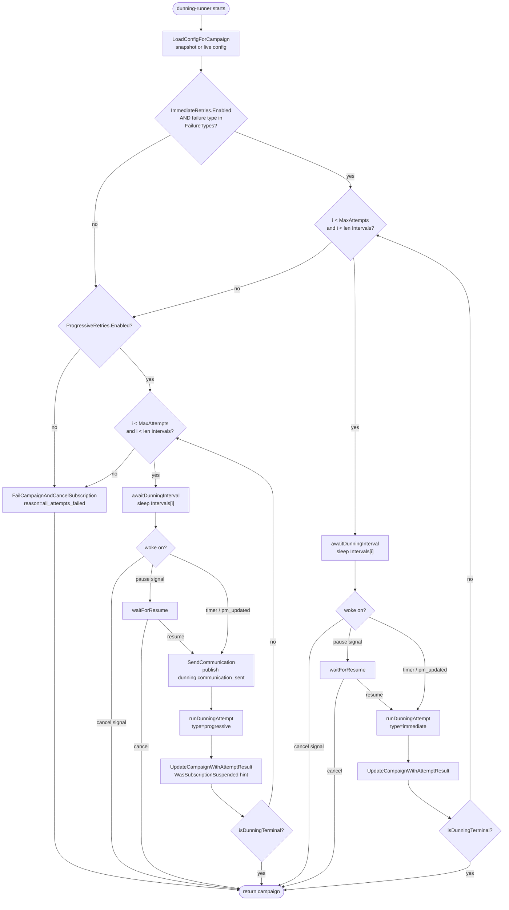
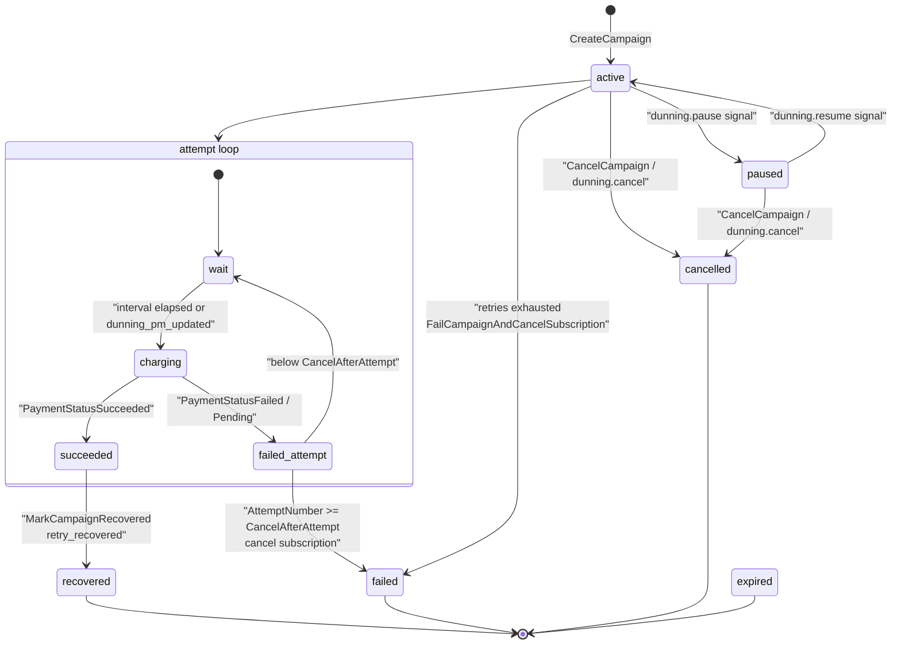

# Dunning & Payment Recovery

When a subscription charge fails, GetPaidHQ opens a **dunning campaign** and starts a durable per-campaign **runner** that schedules retries over time. Each retry runs as a child **dunning-attempt** DAG that re-charges the card; success closes the campaign (recovered, reactivating the subscription if it was suspended) and exhausting the schedule cancels the subscription. The runner is engine-agnostic glue around `DunningService`, which owns the escalation policy (suspend / cancel / mark failed) so the workflow body only needs to know whether the campaign is terminal.

Trigger: `DunningOrchestrationService` subscribes to `subscription.payment.charge.failed` (`port.TopicSubscriptionPaymentChargeFailed`) in its constructor. `HandleSubscriptionChargeFailure` → `StartDunningWorkflow` resolves the org's config, snapshots it onto the campaign, creates the campaign (`DunningStatusActive`, publishes `dunning.started`), then asks the engine to start the `dunning-runner` durable task (`internal/core/service/dunning_orchestration.go`).

## Runner loop (two-phase retry schedule)

## Campaign & attempt state machine

## How it works

### Schedule and backoff

`DefaultDunningConfig` (`internal/core/domain/dunning_config.go`) drives the cadence; an org config snapshot overrides it. Two phases:

- **Immediate retries** — `Enabled`, `MaxAttempts: 3`, `Intervals: ["2m","10m","30m"]`, gated to transient `FailureTypes` (`api_timeout`, `gateway_error`, `processing_error`, `rate_limit`, `network_error`). `shouldUseImmediateRetries` matches `InitialFailureReason` against this list; non-matching failures skip phase 1 entirely.
- **Progressive retries** — `Enabled`, `MaxAttempts: 5`, `Intervals: ["3d","4d","7d","14d","30d"]`, for customer-actionable declines (`card_declined`, `insufficient_funds`, `expired_card`, `do_not_honor`, `generic_decline`). Before each progressive attempt the runner calls `SendCommunication`.

Each loop iteration waits via `awaitDunningInterval` (`internal/adapter/hatchet/workflows/dunning_runner.go`), a durable `ctx.WaitFor(hatchet.OrCondition(...))` over a `SleepCondition` plus four `UserEventCondition` keys built by `internal/adapter/hatchet/workflows/dunning_keys.go`: `dunning_signal:dunning.pause:...`, `:dunning.resume:...`, `:dunning.cancel:...`, and `dunning_pm_updated:...`. Intervals parse via `domain.ParseDuration`; on parse failure phase 1 defaults to `5m` and phase 2 to `72h`. Waits shorter than one second are floored to `1s`.

### Signals

The HTTP-facing `DunningOrchestrationService` (`internal/core/service/dunning_orchestration.go`) mutates campaign state and signals the engine: `PauseCampaign` → `dunning.pause`, `ResumeCampaign` → `dunning.resume`, `CancelCampaign` → `CancelDunningWorkflow`. In the runner, a cancel key returns immediately; a pause key parks in `waitForResume` until a resume or cancel fires; a `dunning_pm_updated` key (`dunningActionImmediateRetry`) breaks the wait and runs the attempt now. Pause/Resume/Cancel guard on status (`DunningStatusActive`/`DunningStatusPaused`) and publish `dunning.paused` / `dunning.resumed` / `dunning.cancelled`.

### Running an attempt

`runDunningAttempt` calls the `dunning-attempt` workflow with `DunningAttemptRunKey(orgId, campaignId, attemptNumber)` for idempotent de-duplication, then reads the result from `TaskOutput("execute-attempt")`. The attempt DAG's single `execute-attempt` task (`internal/adapter/hatchet/workflows/dunning_attempt.go`) runs with a 60s execution timeout, `WithRetries(10)` and `WithRetryBackoff(1.5, 300)`, delegating to `DunningSteps.ExecuteAttempt` → `DunningService.ExecuteAttempt` → `runChargeAttempt` (`internal/core/service/dunning.go`).

`runChargeAttempt` loads the campaign, subscription, customer and payment method, builds a gateway via `GatewayFactory.NewGateway`, and calls `gw.ChargePayment`. It maps the gateway result to a `PaymentStatus` (`ChargePaymentStatusSuccess`→`PaymentStatusSucceeded`, `Pending`→`PaymentStatusPending`, `Error`/`GatewayError`→`PaymentStatusFailed`), persists a `DunningAttempt`, bumps `TotalAttempts`/`ImmediateAttempts`/`ProgressiveAttempts`, and publishes `dunning.attempt_succeeded` or `dunning.attempt_failed` (`internal/core/port/dunning_events.go`).

### Escalation policy

After each attempt the runner calls `UpdateCampaignWithAttemptResult` (`internal/core/service/dunning.go`), which owns all branching:

- **Success** → `MarkCampaignRecovered(..., "retry_recovered", amount)` sets `DunningStatusRecovered`, publishes `dunning.recovered`. If the runner's `WasSubscriptionSuspended` hint is set, it reloads the subscription and, if not already `Active`, flips it back to `SubscriptionStatusActive` and publishes `dunning.subscription_reactivated`.
- **Failure at/after `CancelAfterAttempt`** (default 5) → cancels the subscription (`SubscriptionStatusCancelled`) and `MarkCampaignFailed(..., "max_attempts_reached")` → `DunningStatusFailed`, publishing `dunning.failed`.
- **Failure below the cancel threshold** → computes `isFinalNotice` (`FinalNoticeAttempt`, default 4) and `shouldSuspend` (`SuspendAfterAttempt`, default 3); on first crossing of the suspend threshold it sets the subscription to `SubscriptionStatusUnpaid` and publishes `dunning.subscription_suspended`, then republishes `dunning.attempt_failed` with the `ShouldSuspend`/`IsFinalNotice` flags and returns the still-active campaign so the loop continues.

### Terminal exits

`isDunningTerminal` treats `recovered`, `failed`, `cancelled`, `expired` as terminal. If both phases run out without crossing `CancelAfterAttempt` (e.g. `MaxAttempts < CancelAfterAttempt`), the runner calls `FailCampaignAndCancelSubscription(..., "all_attempts_failed")` so no `Active` subscription is left behind that can never be charged. Campaign status values are defined in `internal/core/domain/dunning.go` (`active`, `paused`, `recovered`, `failed`, `cancelled`, `expired`); attempt types are `immediate`, `progressive`, `manual`, `triggered`.
