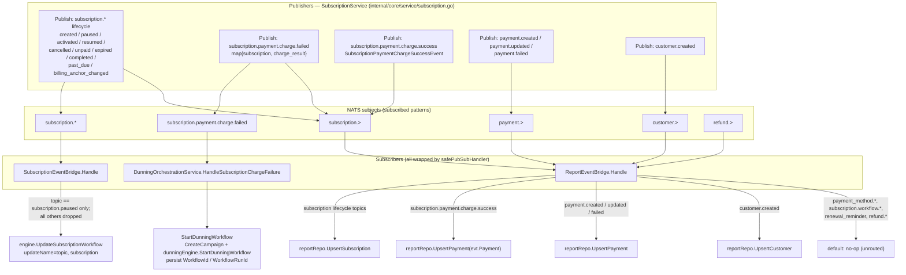

# Event-Driven Bridges (NATS Pub/Sub)

GetPaidHQ decouples the domain layer from the workflow engine and the reporting database with a set of NATS pub/sub *bridges*. Domain services publish `subscription.*`, `payment.*`, `customer.*` and `refund.*` events through `port.PubSub`; three subscribers — `SubscriptionEventBridge`, `DunningOrchestrationService` and `ReportEventBridge` — consume them and translate each into a side effect (forwarding to the engine, starting a dunning workflow, or upserting a reporting row). Every subscriber is wrapped in `safePubSubHandler` so a single panicking callback can never take down the shared NATS receive loop.

## Flow: topics to subscribers to actions

## How it works

### Publishers

All operational events originate in domain services, primarily `SubscriptionService` in `internal/core/service/subscription.go`. Lifecycle transitions are published via `port.GetSubscriptionTopic(status)` (mapping `SubscriptionStatus` to e.g. `subscription.activated`, `subscription.paused`). Charge outcomes publish two distinct shapes:

- **Failure** (`HandleSubscriptionChargeFailure`, line ~584) publishes `subscription.payment.charge.failed` carrying a `map[string]any{"subscription": ..., "charge_result": ...}`, then `payment.created`, then a status-specific lifecycle topic (`cancelled` / `unpaid` / `expired`, or `past_due` only when `subscription.Retries == 1`).
- **Success** (line ~499) publishes `subscription.payment.charge.success` carrying a `port.SubscriptionPaymentChargeSuccessEvent` built by `NewSubscriptionPaymentChargeSuccessEvent`, which embeds the full `domain.Payment`.

Topic strings are the single source of truth in `internal/core/port/topic.go`.

### `SubscriptionEventBridge` — engine fan-in

`NewSubscriptionEventBridge` (`internal/core/service/subscription_event_bridge.go`) subscribes to the wildcard `subscription.*` and registers `Handle` through `safePubSubHandler`. `Handle` unmarshals the `port.PubSubPayload` envelope, re-marshals `envelope.Data`, and decodes it into a `domain.Subscription`. It then switches on `topic`: **only** `port.TopicSubscriptionPaused` (`subscription.paused`) is forwarded — it calls `engine.UpdateSubscriptionWorkflow(ctx, topic, sub)` (`internal/core/port/workflow.go`), passing the topic string as the update name on the per-subscription durable runner. Every other `subscription.*` topic falls through to the `default` branch and is logged and dropped, since the engine has no observer for it.

### `DunningOrchestrationService` — auto-start dunning

`NewDunningOrchestrationService` (`internal/core/service/dunning_orchestration.go`) subscribes to the exact subject `port.TopicSubscriptionPaymentChargeFailed` (`subscription.payment.charge.failed`) and registers `HandleSubscriptionChargeFailure` via `safePubSubHandler`. The handler decodes the envelope into the publisher's `{subscription, charge_result}` shape, then calls `StartDunningWorkflow` with a `domain.StartDunningWorkflowInput` populated from `payload.Subscription` and `payload.ChargeResult` (failed amount, currency, error reason/code, plus `metadata["triggered_by"] = "subscription_charge_failure"`). `StartDunningWorkflow` resolves dunning config (falling back to `domain.DefaultDunningConfig()` on error), snapshots it onto the campaign via `CreateCampaign`, calls `dunningEngine.StartDunningWorkflow` (`internal/core/port/dunning.go`) to obtain `(workflowId, runId)`, and persists those handles back onto the campaign through `UpdateCampaign`. Failures are logged and reported via `errorReporter.ReportError`; the event is not retried.

### `ReportEventBridge` — reporting upserts

`NewReportEventBridge` (`internal/core/service/report_event_bridge.go`) subscribes one wrapped handler to four recursive wildcards: `subscription.>`, `payment.>`, `customer.>`, `refund.>`. `Handle` decodes the envelope, then routes by `topic`:

- Subscription lifecycle topics (`created`, `paused`, `activated`, `resumed`, `cancelled`, `unpaid`, `expired`, `completed`, `past_due`, `billing_anchor_changed`) decode to `domain.Subscription` and call `reportRepo.UpsertSubscription`.
- `subscription.payment.charge.success` decodes to `port.SubscriptionPaymentChargeSuccessEvent` and upserts `evt.Payment` via `reportRepo.UpsertPayment`.
- `payment.created` / `payment.updated` / `payment.failed` decode to `domain.Payment` and call `reportRepo.UpsertPayment`.
- `customer.created` decodes to `domain.Customer` and calls `reportRepo.UpsertCustomer`.
- Everything else in the subscribed namespaces (`payment_method.*`, `subscription.workflow.*`, `subscription.renewal_reminder`, and all `refund.>`) hits the `default` branch and is intentionally ignored — no reporting table exists for them yet.

Each upsert is independent and idempotent; a missed event self-heals on the next event for that entity, and the nightly `ProcessDailyMetrics` cron aggregates the resulting rows.

### Panic safety

`safePubSubHandler` (`internal/core/service/pubsub_handler.go`) wraps every `Subscribe` callback in a `recover()` that logs the handler name, topic, recovered value and stack trace, and deliberately does **not** re-raise. Dropping one event is preferred over crashing the shared NATS receive loop and silencing all other subscribers. Bridge constructors also return an `error` from the first failed `Subscribe` rather than panicking, so a transient NATS hiccup during boot no longer crashes the process before the HTTP server is up.
