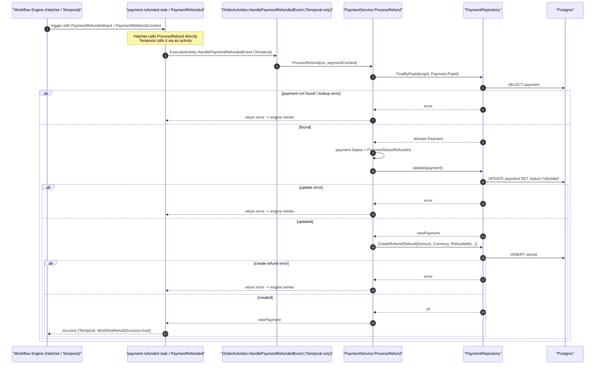

# Payment Refunded Workflow

This workflow handles a single refund event coming from a payment service provider (PSP). It is a thin, single-step workflow: it looks up the original payment by its PSP id, flips that payment's status to `refunded`, and writes a `Refund` row. The Hatchet and Temporal adapters both delegate to the same `PaymentService.ProcessRefund` so behaviour stays identical across engines.

Note that, unlike the payment-success path, the refund path publishes **no** NATS events, fires **no** webhooks, and touches **no** subscription or order state — it only mutates the payment and creates the refund record.

## How it works

1. **Entry points.** Both engines take a `domain.PaymentWebhookContext` as input. The Hatchet adapter defines a `StandaloneTask` named `"payment-refunded"` whose handler receives `PaymentRefundedInput` and calls `paymentService.ProcessRefund(ctx, input.PaymentContext)` directly — see `internal/adapter/hatchet/workflows/payment_refunded.go` and the input struct in `internal/adapter/hatchet/workflows/types.go`. The Temporal adapter's `PaymentRefunded` workflow instead schedules a single activity, `OrderActivities.HandlePaymentRefundedEvent`, via `ExecuteActivity` — see `internal/adapter/temporal/workflows/payment_refunded.go`.

2. **Activity delegation (Temporal).** `HandlePaymentRefundedEvent` in `internal/adapter/temporal/activities/order_activities.go` is a thin coordinator: it logs, calls `a.paymentService.ProcessRefund(ctx, paymentContext)`, and on error wraps it with `temporal.NewApplicationError("Can't process refund", "refund", err)` — a **retryable** application error (unlike the order-completion path, which uses `NewNonRetryableApplicationError`).

3. **Core logic.** `PaymentService.ProcessRefund` in `internal/core/service/payment.go` does the actual work:
   - `paymentRepository.FindByPspId(ctx, paymentContext.OrgId, paymentContext.Payment.PspId)` locates the original payment by org + PSP id.
   - Sets `payment.Status = domain.PaymentStatusRefunded` (the `"refunded"` enum from `internal/core/domain/payment_types.go`) and persists it with `paymentRepository.Update`.
   - Calls `paymentRepository.CreateRefund` with a new `domain.Refund` (`internal/core/domain/refund.go`), id generated via `lib.GenerateId("refund")`, copying `Amount` and `Currency` from `paymentContext.Payment` and stamping `RefundedAt`/`CreatedAt`/`UpdatedAt` with `time.Now().UTC()`.
   - Returns the updated payment. Any repository error is logged and returned, which bubbles up to the engine and triggers a retry.

4. **Retry / idempotency.** Both engines cap at **10 attempts** with a flat backoff. Hatchet: `WithExecutionTimeout(10s)`, `WithRetries(10)`, `WithRetryBackoff(1.0, 60)` (the source comment claiming "indefinitely / no max-attempts" is stale — the code sets 10). Temporal: `StartToCloseTimeout: 10s`, `RetryPolicy{InitialInterval: 1m, BackoffCoefficient: 1.0, MaximumAttempts: 10}`. There is no explicit idempotency guard; a re-delivered refund event would re-set the status to `refunded` and insert another `Refund` row.

5. **Result.** Temporal returns `port.WorkflowResult{Success: true, Message: "Refund event processed", Payload: payment}`; Hatchet returns the `domain.Payment` directly. No events, webhooks, or subscription side effects are emitted in this path.
