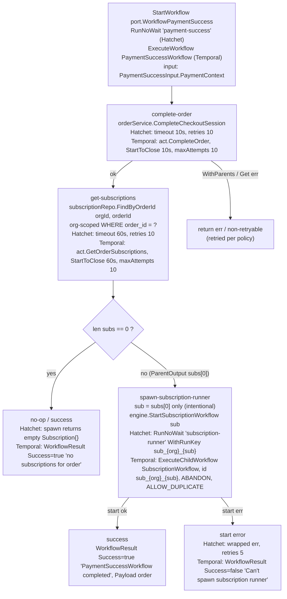

# Payment Success Workflow

The payment-success workflow runs when a PSP webhook (Paystack / Checkout.com) reports a successful payment. It completes the order, loads the subscriptions linked to that order by `order_id` within the org, and starts the long-running `subscription-runner` for the first subscription. Both engines implement the same three-step shape: Hatchet as a DAG of `wf.NewTask` steps wired with `WithParents`, Temporal as a sequential workflow over `OrderActivities` plus a detached child workflow. The order→subscription linkage this DAG depends on was corrected in commit `a46c4e0` — subscription rows created at order time now actually persist (variant FK populated, `NOT NULL` metadata defaulted to `{}`), so `get-subscriptions` reliably finds them.

## How it works

1. **Trigger.** `Hatchet.StartWorkflow` (`internal/adapter/hatchet/hatchet.go`) and `Temporal.StartWorkflow` (`internal/adapter/temporal/temporal.go`) both handle `port.WorkflowPaymentSuccess`, coercing the payload into a `domain.PaymentWebhookContext` via `domain.ParsePaymentWebhookContext`. Hatchet fires `client.RunNoWait("payment-success", PaymentSuccessInput{PaymentContext})`; Temporal calls `client.ExecuteWorkflow(..., workflows.PaymentSuccessWorkflow, PaymentSuccessInput{PaymentContext})`. Both return immediately with `"payment-success queued"`.

2. **complete-order.** The Hatchet `complete-order` task and Temporal `act.CompleteOrder` activity (`internal/adapter/temporal/activities/order_activities.go`) both delegate to `OrderWorkflowService.CompleteCheckoutSession` (`internal/core/service/order_workflow.go`). It loads the order, sets `Status = domain.OrderStatusCompleted`, creates a `domain.PaymentMethod` from the webhook context, then iterates `subscriptionRepo.FindByOrderId` results — marking each `SubscriptionStatusActive` when `Payment.Amount > 0` and `StartDate` is in the past (recording revenue and `CyclesProcessed = 1`), otherwise `SubscriptionStatusTrial` — and records a succeeded `domain.Payment` when `Amount > 0`. Temporal wraps a service error as `temporal.NewNonRetryableApplicationError`; Hatchet returns the raw error and leans on `WithRetries(10)`.

3. **get-subscriptions.** Hatchet's `get-subscriptions` task (parent `complete-order`) and Temporal's `act.GetOrderSubscriptions` both call `subscriptionRepo.FindByOrderId(ctx, orgId, orderId)` (`internal/adapter/db/postgrespgx/subscription_repo.go`). That query filters on `org_id` plus `order_id` — org-isolation via `OrgScope` (`internal/adapter/db/postgrespgx/scopes.go`) plus the order FK. The rows it returns were written in `OrderService.CreateOrder` (`internal/core/service/order.go`), one per `OrderItem` whose `Price.Category == domain.PriceCategorySubscription`, with `subscription.OrderId` set by `domain.NewSubscriptionFromOrderItem`. The `a46c4e0` fix is what makes this resolution reliable: `OrderItem.VariantId` is now threaded from `item.Price.VariantId` (previously empty, violating `order_items_org_id_variant_id_fkey`), and `SubscriptionRepo.Create` / `OrderRepo.Create*` default nil metadata to `{}` via `emptyIfNil` (`scopes.go`) so the `NOT NULL` metadata columns no longer reject the insert. Without those, the subscription/order-item rows never committed and `FindByOrderId` returned nothing.

4. **Branch on emptiness.** If `FindByOrderId` returns zero rows, the workflow short-circuits to success: Hatchet's `spawn-subscription-runner` returns an empty `domain.Subscription{}`; Temporal returns `WorkflowResult{Success: true, Message: "no subscriptions for order", Payload: order}`. No runner is started.

5. **spawn-subscription-runner.** Only `subs[0]` is processed — one runner per order, intentionally. Hatchet reads the upstream output with `ctx.ParentOutput(getSubscriptions, &subs)` and calls `engine.StartSubscriptionWorkflow(ctx, subs[0])`, which issues `RunNoWait("subscription-runner", sub, WithRunKey(SubscriptionRunKey(sub.OrgId, sub.Id)))` — run key `sub_{org}_{sub}` (`internal/adapter/hatchet/workflows/keys.go`) makes the spawn idempotent. Temporal starts a detached child via `ExecuteChildWorkflow(SubscriptionWorkflow, sub)` with `WorkflowID = SubscriptionWorkflowID(sub.OrgId, sub.Id)` (also `sub_{org}_{sub}`, `internal/adapter/temporal/workflows/keys.go`), `ParentClosePolicy = PARENT_CLOSE_POLICY_ABANDON`, and `WorkflowIDReusePolicy = WORKFLOW_ID_REUSE_POLICY_ALLOW_DUPLICATE`, waiting only on `GetChildWorkflowExecution()` (start, not completion). A start failure returns `WorkflowResult{Success: false, Message: "Can't spawn subscription runner"}`; on success Temporal returns `WorkflowResult{Success: true, Message: "PaymentSuccessWorkflow completed", Payload: order}`.

Step/retry tuning differs by engine but the topology matches. Hatchet: `complete-order` 10s/retries 10, `get-subscriptions` 60s/retries 10, `spawn-subscription-runner` 30s/retries 5 (`internal/adapter/hatchet/workflows/payment_success.go`). Temporal: `CompleteOrder` StartToClose 10s, `GetOrderSubscriptions` 60s, both `MaximumAttempts: 10`, `InitialInterval: 1m`, `BackoffCoefficient: 1.0` (`internal/adapter/temporal/workflows/payment_success.go`).
