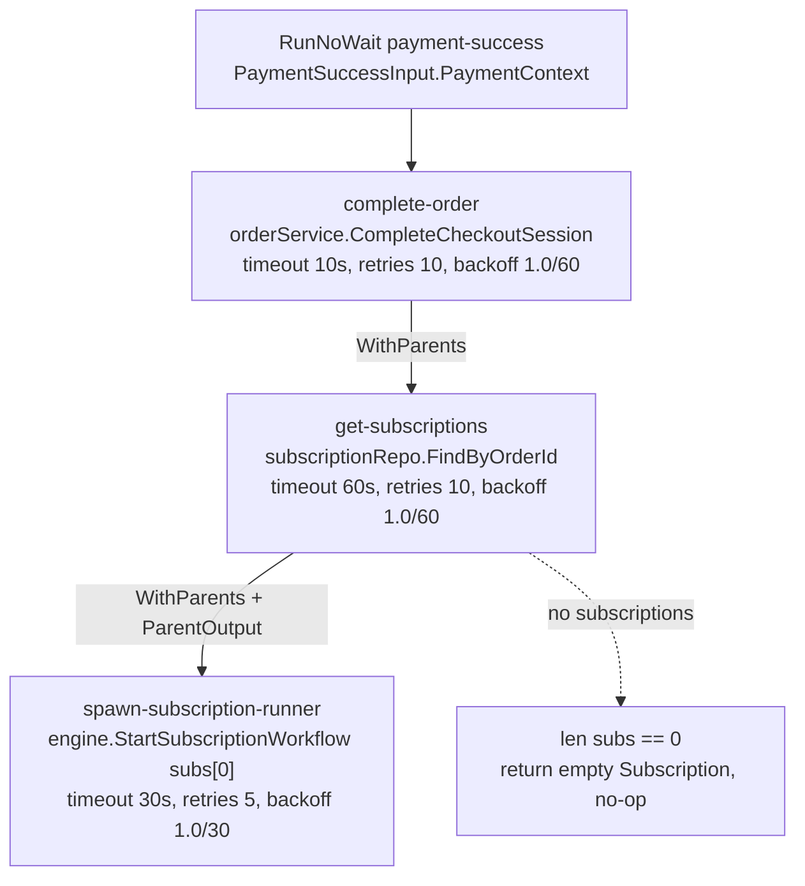
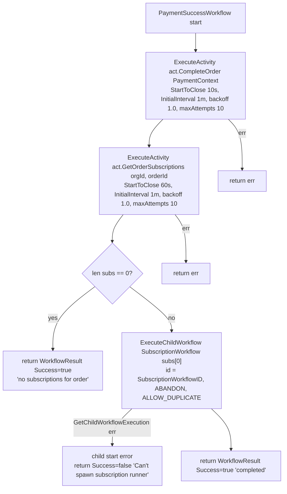

# Payment Success Workflow

The payment-success workflow runs when a PSP webhook (Paystack / Checkout.com) reports a successful payment. It marks the order paid, loads any subscriptions attached to the order, and starts the long-running subscription runner for the first subscription. Both engines implement the same three-step shape: Hatchet as a DAG of `wf.NewTask` steps wired with `WithParents`, Temporal as a sequential workflow executing `OrderActivities` plus a detached child workflow. The workflow is triggered fire-and-forget via `RunNoWait` (Hatchet) / `ExecuteWorkflow` (Temporal) from `StartWorkflow` with `port.WorkflowPaymentSuccess`, carrying a `PaymentSuccessInput{PaymentContext}`.

## DAG (Hatchet)

## Sequence (Temporal)

## How it works

1. Trigger. `Hatchet.StartWorkflow` (`internal/adapter/hatchet/hatchet.go`) and `Temporal.StartWorkflow` (`internal/adapter/temporal/temporal.go`) handle `port.WorkflowPaymentSuccess`, coercing the payload to a `domain.PaymentWebhookContext` (via `domain.ParsePaymentWebhookContext` if needed) and launching the workflow without waiting on the result.

2. complete-order. The Hatchet `complete-order` task and the Temporal `act.CompleteOrder` activity both call `OrderWorkflowService.CompleteCheckoutSession` (`internal/core/service/order_workflow.go`). That method loads the order, sets `Status = domain.OrderStatusCompleted`, persists a `domain.PaymentMethod` from the webhook context, iterates subscriptions found via `FindByOrderId` (activating to `SubscriptionStatusActive` when `Payment.Amount > 0` and `StartDate` is in the past, otherwise `SubscriptionStatusTrial`), records a succeeded `domain.Payment` when `Amount > 0`, and publishes `port.TopicOrderCompleted`. In Temporal, a service error is wrapped as a non-retryable error via `temporal.NewNonRetryableApplicationError`; the Hatchet step returns the raw error and relies on `WithRetries(10)`.

3. get-subscriptions. The Hatchet `get-subscriptions` task (parent: `complete-order`) and Temporal `act.GetOrderSubscriptions` both call `subscriptionRepo.FindByOrderId(ctx, orgId, orderId)` (`internal/adapter/temporal/activities/order_activities.go`). If the result is empty, the workflow short-circuits: Hatchet's `spawn-subscription-runner` returns an empty `domain.Subscription`; Temporal returns `WorkflowResult{Success: true, Message: "no subscriptions for order"}`.

4. spawn-subscription-runner. Only the first subscription (`subs[0]`) is processed, intentionally preserving current behaviour. Hatchet reads the parent output via `ctx.ParentOutput(getSubscriptions, &subs)` and calls `engine.StartSubscriptionWorkflow`, which issues `RunNoWait("subscription-runner", sub, WithRunKey(SubscriptionRunKey(orgId, subId)))` — the run key `sub_<org>_{sub}` (`internal/adapter/hatchet/workflows/keys.go`) makes the spawn idempotent. Temporal instead starts a detached child via `ExecuteChildWorkflow(SubscriptionWorkflow, sub)` with `WorkflowID = SubscriptionWorkflowID(sub.OrgId, sub.Id)` (`sub_<org>_{sub}`), `ParentClosePolicy = PARENT_CLOSE_POLICY_ABANDON`, and `WorkflowIDReusePolicy = WORKFLOW_ID_REUSE_POLICY_ALLOW_DUPLICATE`, waiting only on `GetChildWorkflowExecution()` (start, not completion). A start failure returns `WorkflowResult{Success: false, Message: "Can't spawn subscription runner"}`.

Step/retry tuning differs by engine but the topology matches. Hatchet: `complete-order` 10s/retries 10, `get-subscriptions` 60s/retries 10, `spawn-subscription-runner` 30s/retries 5 (`internal/adapter/hatchet/workflows/payment_success.go`). Temporal: `CompleteOrder` StartToClose 10s, `GetOrderSubscriptions` 60s, both with `MaximumAttempts: 10` and `InitialInterval: 1m, BackoffCoefficient: 1.0` (`internal/adapter/temporal/workflows/payment_success.go`).
