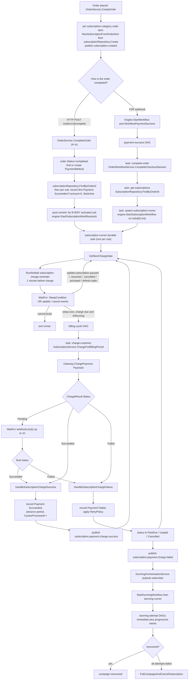
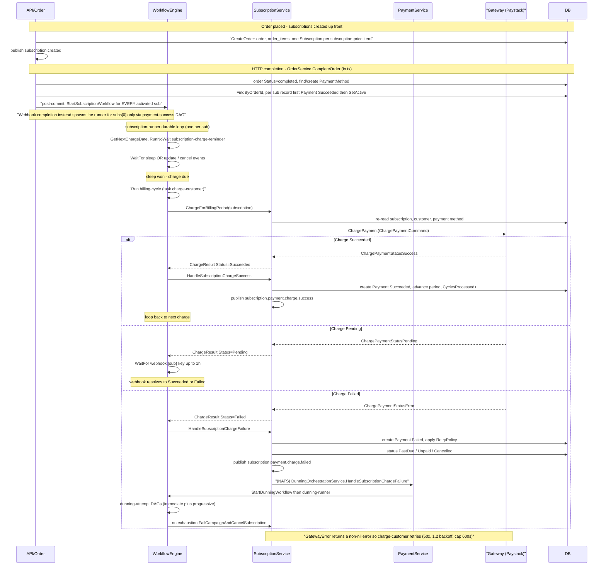

# Subscription Payments — End to End

This is the flagship trace of how a subscription gets paid in GetPaidHQ, from the moment an order is placed and paid through every recurring charge that follows — and what happens when a charge fails.

The order→subscription linkage was corrected in commit `a46c4e0` and its design note (`docs/superpowers/specs/2026-06-03-order-subscription-http-driver-design.md`). The important fact: a **`domain.Subscription` row is created at order-creation time**, one per subscription-category order item, inside `OrderService.CreateOrder` (`internal/core/service/order.go`). Order *completion* then finds those rows by order id and spawns a durable per-subscription runner. There are two completion paths — the HTTP path spawns a runner for **every** activated subscription; the webhook DAG spawns one for `subs[0]` only.

The engine port (`internal/core/port/workflow.go`) is satisfied by both the Hatchet adapter (default, selected via `WORKFLOW_ENGINE` in `internal/config/app.go`) and the Temporal adapter. All step/action and event-key names below are the real Hatchet names under `internal/adapter/hatchet/`; Temporal mirrors them. Two durable tasks anchor the design: the per-subscription `subscription-runner` that schedules every charge, and the per-campaign `dunning-runner` that drives recovery. Charge failure does **not** signal the runner directly — it travels over NATS pub/sub on `subscription.payment.charge.failed`, which `DunningOrchestrationService` subscribes to.

## High-level flow

## Sequence — happy path and failure-to-dunning

## How it works

### 1. Order placed — subscriptions created up front

`OrderService.CreateOrder` (`internal/core/service/order.go`) builds the cart, the `Order` (`OrderStatusPending`), and an `OrderItem` per cart line. For each item whose `Price.Category == domain.PriceCategorySubscription` it builds a subscription via `domain.NewSubscriptionFromOrderItem`, stamps `CustomerId`, `PspId` and `PaymentMethodId` from the input, persists it with `subscriptionRepository.Create`, and publishes `port.TopicSubscriptionCreated`. This is the linkage corrected in `a46c4e0`: the `OrderItem.VariantId` is now threaded from `item.Price.VariantId` (it was previously unset, violating `order_items_org_id_variant_id_fkey`), and the repos default nil metadata to `{}` via `emptyIfNil` (`internal/adapter/db/postgrespgx/scopes.go`) so the NOT-NULL metadata columns on orders, order_items and subscriptions are never written as SQL NULL. Subscriptions are subsequently retrieved for an order via `SubscriptionRepository.FindByOrderId` — a plain `org_id` + `order_id` scoped query (`internal/adapter/db/postgrespgx/subscription_repo.go`, `OrgScope` in `scopes.go`).

The gateway is only contacted when a `session_id` is supplied (`createPspSession`); a direct cart skips the PSP entirely, which is what the ADR's runnable `.http` driver relies on.

### 2. Order completed — runner spawned per subscription

There are two completion paths, deliberately split to avoid a construction-time cycle (the webhook path runs *inside* a workflow step and so cannot hold the engine that dispatches it):

- **HTTP path — `OrderService.CompleteOrder`** (`internal/core/service/order.go`). All DB writes run in one `tx.RunInTx`: flip the order to `OrderStatusCompleted`, resolve or create the `PaymentMethod`, then `subscriptionRepository.FindByOrderId` and, per subscription, record a first `Payment` with `PaymentStatusSucceeded` when `input.Payment.Amount > 0` and call `subscription.SetActive(payment)`. **After the tx commits**, it loops over the collected `activated` slice and calls `engine.StartSubscriptionWorkflow(sub)` for **every** activated subscription, then publishes `port.TopicOrderCompleted`. These post-commit side effects are intentionally fire-and-forget: a failure is logged, not returned, because the order is already committed.
- **Webhook path — `payment-success` DAG** (`internal/adapter/hatchet/workflows/payment_success.go`), kicked off by `Engine.StartWorkflow(port.WorkflowPaymentSuccess)` which `RunNoWait`s `payment-success` (`internal/adapter/hatchet/hatchet.go`). Three tasks: **`complete-order`** → `OrderWorkflowService.CompleteCheckoutSession` (`internal/core/service/order_workflow.go`; charged subs become `SubscriptionStatusActive` with `CyclesProcessed=1`, not-yet-started ones `SubscriptionStatusTrial`); **`get-subscriptions`** → `SubscriptionRepository.FindByOrderId`; **`spawn-subscription-runner`** → `engine.StartSubscriptionWorkflow` on **`subs[0]` only** (single-subscription behaviour is intentional here). The first task retries up to 10x with backoff.

### 3. The durable `subscription-runner`

`Engine.StartSubscriptionWorkflow` `RunNoWait`s the `subscription-runner` standalone durable task keyed by `SubscriptionRunKey(orgId, subId)`, making the start idempotent (`internal/adapter/hatchet/hatchet.go`, `internal/adapter/hatchet/workflows/subscription_runner.go`). Each loop iteration:

1. Returns immediately if `isTerminalStatus` (`Cancelled`, `Expired`, `Completed`) or `GetNextChargeDate()` is zero.
2. Spawns a detached `subscription-charge-reminder` via `RunNoWait` one minute before the charge, keyed by `ReminderRunKey`.
3. `WaitFor` an `OrCondition` of a `SleepCondition` until the charge time OR user events: `update:subscription.paused` / `.resumed` / `.cancelled` / `.activated`, `update:refresh-state`, and `cancel:{sub}`. A `cancel:{sub}` exits the runner; any `update:*` event swaps in the fresh `domain.Subscription` payload and restarts the loop. These keys come from `UpdateEventKey` / `CancelEventKey` (`internal/adapter/hatchet/workflows/keys.go`) and are pushed by `Engine.UpdateSubscriptionWorkflow` / `CancelSubscriptionWorkflow`, which `SubscriptionOrchestrationService` invokes on every lifecycle transition (`internal/core/service/subscription_orchestration.go`).
4. When the sleep wins, the subscription `IsRunning()`, and the charge date has not moved into the future, it `Run`s the `billing-cycle` DAG keyed by `BillingRunKey(orgId, subId, CyclesProcessed)` — the cycle index gives one-charge-per-cycle idempotency.

### 4. `billing-cycle` → gateway charge

The `billing-cycle` workflow is a single synchronous task, **`charge-customer`**, retried up to 50x with `1.2` backoff capped at 600s (`internal/adapter/hatchet/workflows/billing_cycle.go`). It calls `SubscriptionService.ChargeForBillingPeriod` (`internal/core/service/subscription.go`), which re-reads the subscription, resolves the gateway via `GatewayFactory.NewGateway`, loads the customer and payment method, and calls `gw.ChargePayment`. Outcome mapping:

- `domain.GatewayError` (transport failure) → returns a non-nil **error**, so `charge-customer` retries. This is the transient-retry path.
- `ChargePaymentStatusSuccess` → `ChargeResult.Status = PaymentStatusSucceeded`.
- `ChargePaymentStatusPending` → `PaymentStatusPending`.
- `ChargePaymentStatusError` → `PaymentStatusFailed`.

### 5. Resolving Pending, then recording the result

Back in the runner, the `charge-customer` output is read via `TaskOutput("charge-customer").Into(&chargeResult)`. If `PaymentStatusPending`, the runner `WaitFor`s the `webhook:{sub}` key (`WebhookEventKey`) for up to 1h; an arriving webhook payload replaces the `ChargeResult` with its final status. The runner then dispatches on status:

- **Succeeded** → `SubscriptionService.HandleSubscriptionChargeSuccess`: creates a recurring `Payment`, advances `CurrentPeriodStart`/`CurrentPeriodEnd` via `CalculateNextBillingDate`, increments `CyclesProcessed`, resets `Retries`/`NextRetryAt`, and either completes the subscription (`Cycles` reached → `SubscriptionStatusCompleted`) or sets it back to `SubscriptionStatusActive`. Publishes `port.TopicSubscriptionPaymentChargeSuccess` (plus `…Completed` / `…Expired` where applicable). The loop continues to the next cycle.
- **Failed** → `HandleSubscriptionChargeFailure`: creates a failed `Payment`, then applies the org `RetryPolicy` (`GetRetryPolicy`, default 3 attempts / minute interval / `FailureActionCancel`). If retries remain, status becomes `SubscriptionStatusPastDue` with `NextRetryAt` and `Retries++`; if exhausted, `FailureActionMarkUnpaid` → `SubscriptionStatusUnpaid` or `FailureActionCancel` → cancelled. Publishes `port.TopicSubscriptionPaymentChargeFailed` (and `…PastDue` on the first failure) plus the matching status-specific topic.

### 6. Failure → dunning recovery

The failure branch is decoupled via pub/sub. `DunningOrchestrationService` subscribes to `port.TopicSubscriptionPaymentChargeFailed` at construction (`internal/core/service/dunning_orchestration.go`). On each event it unmarshals the `{subscription, charge_result}` payload and calls `StartDunningWorkflow`, which creates a campaign and asks the engine to `RunNoWait` the **`dunning-runner`** durable task keyed by `DunningRunKey` (`internal/adapter/hatchet/hatchet.go`).

The `dunning-runner` (`internal/adapter/hatchet/workflows/dunning_runner.go`) runs two phases: **immediate retries** (short, technical-failure-only, gated by `shouldUseImmediateRetries`) and **progressive retries** (long customer-driven waits with comms sent before each attempt). Each attempt runs the child **`dunning-attempt`** DAG (`execute-attempt` task), and the outcome is fed to `DunningService.UpdateCampaignWithAttemptResult`, which owns the recover/suspend/cancel escalation policy. The runner respects `dunning_signal:dunning.pause` / `.resume` / `.cancel` and `dunning_pm_updated` (which forces an immediate retry) at every wait. It exits on terminal campaign status (`recovered`, `failed`, `cancelled`, `expired`); if all attempts are exhausted it calls `FailCampaignAndCancelSubscription` so no Active-but-uncollectable subscription is left behind.
