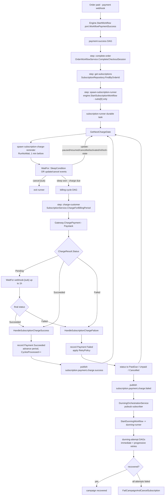
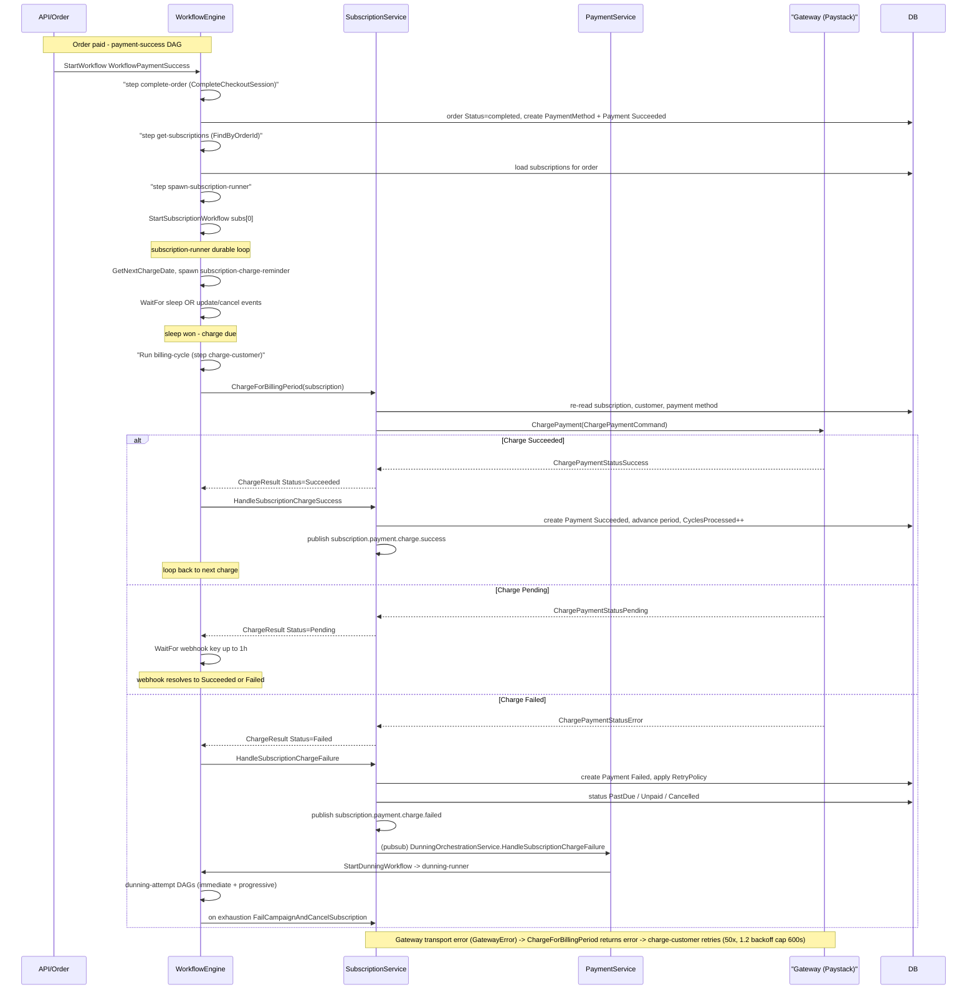

# Subscription Payments — End to End

This is the flagship trace of how a subscription gets paid in GetPaidHQ, from the moment an order is paid to the recurring charges that follow — and what happens when one of those charges fails.

The engine port (`internal/core/port/workflow.go`) is satisfied by both the Hatchet adapter (default) and the Temporal adapter. All the real step/action names below come from the Hatchet adapter under `internal/adapter/hatchet/workflows/`; the Temporal adapter mirrors them. Two durable, long-running tasks anchor the design: the per-subscription `subscription-runner` that schedules every charge, and the per-campaign `dunning-runner` that drives recovery after a failed charge. Charge failure does **not** signal the runner directly — it travels over NATS pub/sub on the `subscription.payment.charge.failed` topic, which the dunning orchestrator is subscribed to.

## High-level flow

## Sequence — happy path and failure-to-dunning

## How it works

### 1. Order paid -> `payment-success` DAG

A successful payment webhook drives `Engine.StartWorkflow` with `port.WorkflowPaymentSuccess`, which `RunNoWait`s the `payment-success` workflow (`internal/adapter/hatchet/hatchet.go`). The DAG has three tasks (`internal/adapter/hatchet/workflows/payment_success.go`):

- **`complete-order`** calls `OrderWorkflowService.CompleteCheckoutSession` (`internal/core/service/order_workflow.go`). It flips the order to `OrderStatusCompleted`, creates a `PaymentMethod` from the webhook's payment context, activates the order's subscriptions (charged subs become `SubscriptionStatusActive` with `CyclesProcessed=1`; not-yet-started ones become `SubscriptionStatusTrial`), records a `Payment` with `PaymentStatusSucceeded` when `paymentCtx.Payment.Amount > 0`, and publishes `port.TopicOrderCompleted`. Retried up to 10x with backoff.
- **`get-subscriptions`** loads `SubscriptionRepository.FindByOrderId` (parent: `complete-order`).
- **`spawn-subscription-runner`** takes **only `subs[0]`** (single-subscription behaviour is intentional) and calls `engine.StartSubscriptionWorkflow(sub)`.

Note the two completion paths: the webhook path above uses `OrderWorkflowService` (no engine dependency, since it runs *inside* a workflow step), while the HTTP `CompleteOrder` path lives on `OrderService` (`internal/core/service/order.go`) and starts the runner itself post-commit. The split avoids a construction-time cycle.

### 2. The durable `subscription-runner`

`StartSubscriptionWorkflow` runs the `subscription-runner` standalone durable task keyed by `SubscriptionRunKey(orgId, subId)`, making the start idempotent (`internal/adapter/hatchet/workflows/subscription_runner.go`). Each loop iteration:

1. Returns immediately if `isTerminalStatus` (`Cancelled`, `Expired`, `Completed`) or `GetNextChargeDate()` is zero.
2. Spawns a detached `subscription-charge-reminder` via `RunNoWait` one minute before the charge, keyed by `ReminderRunKey`.
3. `WaitFor` an `OrCondition` of a `SleepCondition` until the charge time OR user events: `update:subscription.paused`/`.resumed`/`.cancelled`/`.activated`, `update:refresh-state`, and `cancel:{sub}`. A `cancel:{sub}` exits the runner; any `update:*` event swaps in the fresh `domain.Subscription` payload and restarts the loop. These keys are produced by `UpdateEventKey` / `CancelEventKey` (`internal/adapter/hatchet/workflows/keys.go`) and pushed by `Engine.UpdateSubscriptionWorkflow` / `CancelSubscriptionWorkflow`, which `SubscriptionOrchestrationService` calls on every lifecycle transition (`internal/core/service/subscription_orchestration.go`).
4. When the sleep wins and the subscription `IsRunning()`, it `Run`s the `billing-cycle` DAG keyed by `BillingRunKey(orgId, subId, CyclesProcessed)` — the cycle counter in the key gives one-charge-per-cycle idempotency.

### 3. `billing-cycle` -> gateway charge

The `billing-cycle` workflow is a single synchronous task, **`charge-customer`**, retried up to 50x with `1.2` backoff capped at 600s (`internal/adapter/hatchet/workflows/billing_cycle.go`). It calls `SubscriptionService.ChargeForBillingPeriod` (`internal/core/service/subscription.go`), which re-reads the subscription, resolves the gateway via `GatewayFactory.NewGateway`, loads the customer and payment method, and calls `gw.ChargePayment`. Outcome mapping:

- `domain.GatewayError` (transport failure) -> returns a non-nil **error**, so `charge-customer` retries. This is the transient-retry path.
- `ChargePaymentStatusSuccess` -> `ChargeResult.Status = PaymentStatusSucceeded`.
- `ChargePaymentStatusPending` -> `PaymentStatusPending`.
- `ChargePaymentStatusError` -> `PaymentStatusFailed`.

### 4. Resolving Pending, then recording the result

Back in the runner, the `charge-customer` output is read via `TaskOutput("charge-customer").Into(&chargeResult)`. If `PaymentStatusPending`, the runner `WaitFor`s the `webhook:{sub}` key (`WebhookEventKey`) for up to 1h; an arriving webhook payload replaces the `ChargeResult` with its final status. The runner then dispatches on status:

- **Succeeded** -> `SubscriptionService.HandleSubscriptionChargeSuccess`: creates a recurring `Payment`, advances `CurrentPeriodStart/End` via `CalculateNextBillingDate`, increments `CyclesProcessed`, resets `Retries`/`NextRetryAt`, and either completes the subscription (`Cycles` reached) or sets it back to `Active`. Publishes `port.TopicSubscriptionPaymentChargeSuccess` (plus `…Completed`/`…Expired` where applicable). The loop continues to the next cycle.
- **Failed** -> `HandleSubscriptionChargeFailure`: creates a failed `Payment`, then applies the org `RetryPolicy` (`GetRetryPolicy`, default 3 attempts / minute interval / `FailureActionCancel`). If retries remain, status becomes `SubscriptionStatusPastDue` with `NextRetryAt`/`Retries++`; if exhausted, `FailureActionMarkUnpaid` -> `Unpaid` or `FailureActionCancel` -> cancelled. It publishes `port.TopicSubscriptionPaymentChargeFailed` (and `…PastDue` on the first failure), then status-specific topics.

### 5. Failure -> dunning recovery

The failure branch is decoupled via pub/sub. `DunningOrchestrationService` subscribes to `port.TopicSubscriptionPaymentChargeFailed` at construction (`internal/core/service/dunning_orchestration.go`). On each event it unmarshals the `{subscription, charge_result}` payload and calls `StartDunningWorkflow`, which creates a campaign and asks the engine to `RunNoWait` the **`dunning-runner`** durable task keyed by `DunningRunKey` (`internal/adapter/hatchet/hatchet.go`).

The `dunning-runner` (`internal/adapter/hatchet/workflows/dunning_runner.go`) runs two phases: **immediate retries** (short, technical-failure-only, gated by `shouldUseImmediateRetries`) and **progressive retries** (long customer-driven waits with comms sent before each attempt). Each attempt runs the child **`dunning-attempt`** DAG (`execute-attempt` task), and the outcome is fed to `DunningService.UpdateCampaignWithAttemptResult`, which owns the recover/suspend/cancel escalation policy. The runner respects `dunning_signal:dunning.pause`/`.resume`/`.cancel` and `dunning_pm_updated` (which forces an immediate retry) at every wait. It exits on terminal campaign status (`recovered`, `failed`, `cancelled`, `expired`); if all attempts are exhausted it calls `FailCampaignAndCancelSubscription` so no Active-but-uncollectable subscription is left behind.
