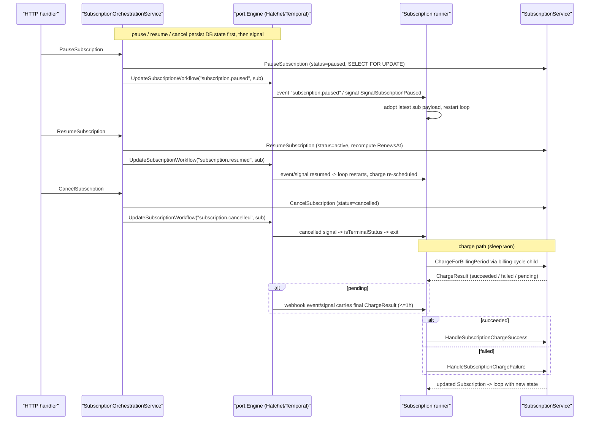

# Subscription Runner (Durable Lifecycle)

The subscription runner is the per-subscription long-running durable workflow that owns the billing lifecycle of one `domain.Subscription`. It loops forever: compute the next charge date, spawn a reminder, sleep until that date (or until a control signal fires), run a single charge through the billing-cycle child, then hand the `ChargeResult` back to `SubscriptionService` to advance state. It exits only when the subscription reaches a terminal status (`cancelled`, `expired`, `completed`) or receives an explicit cancel signal.

There are two parity implementations behind the `port.Engine` interface: Hatchet (`internal/adapter/hatchet/workflows/subscription_runner.go`, the standalone durable task `subscription-runner`) and Temporal (`internal/adapter/temporal/workflows/subscription_workflow.go`, `SubscriptionWorkflow`). Both share identical addressing — one runner per `(orgId, subscriptionId)` tuple — and identical signal/state semantics.

## State machine

```mermaid
stateDiagram-v2
    [*] --> active : "Activate -> StartSubscriptionWorkflow"

    state "active / trial / past_due (running)" as running
    state "charging (billing-cycle child)" as charging
    state "await webhook (<= 1h)" as await_webhook

    active --> running

    running --> running : "control signal updates state and restarts loop"
    running --> paused : "subscription.paused signal"
    running --> cancelled : "subscription.cancelled signal"
    running --> [*] : "cancel signal (graceful exit)"

    paused --> active : "subscription.resumed / subscription.activated signal"
    paused --> paused : "sleep wins while paused -> skip charge, loop"

    running --> charging : "sleep wins and IsRunning and charge date reached"

    charging --> await_webhook : "ChargeResult.Status == pending"
    charging --> success : "ChargeResult.Status == succeeded"
    charging --> failure : "ChargeResult.Status == failed"
    await_webhook --> success : "webhook delivers succeeded"
    await_webhook --> failure : "webhook delivers failed or 1h timeout"

    state "HandleSubscriptionChargeSuccess" as success
    state "HandleSubscriptionChargeFailure" as failure

    success --> active : "more cycles remain -> RenewsAt advanced"
    success --> completed : "Cycles reached (CyclesProcessed >= Cycles)"

    failure --> past_due : "retry available -> NextRetryAt set, Retries++"
    failure --> unpaid : "no retries and FailureAction == mark_unpaid"
    failure --> cancelled : "no retries and FailureAction == cancel"

    completed --> [*]
    cancelled --> [*]
    unpaid --> running : "loops; charge date drives behavior"

    note right of running
        Statuses that loop without charging:
        paused, non_renewing -> continue
        not IsRunning() -> continue
        next charge in future -> continue
    end note
```

## Signals

## How it works

**Start and idempotency.** `SubscriptionOrchestrationService.Activate` (`internal/core/service/subscription_orchestration.go`) sets the status to `active` then calls `engine.StartSubscriptionWorkflow`. Hatchet runs `subscription-runner` with `WithRunKey(SubscriptionRunKey(orgId, id))` = `sub_<org>_<id>`; Temporal starts `SubscriptionWorkflow` with the same id and `WORKFLOW_ID_CONFLICT_POLICY_USE_EXISTING`, so re-activation is a no-op rather than a duplicate runner (`internal/adapter/hatchet/hatchet.go`, `internal/adapter/temporal/temporal.go`).

**The loop.** Each iteration first checks `isTerminalStatus` / `isTerminalSubscriptionStatus` (`cancelled`, `expired`, `completed`) and returns if terminal. It computes `sub.GetNextChargeDate()` (`internal/core/domain/subscription.go`: `NextRetryAt` when `past_due`, else `RenewsAt`); a zero time ends the workflow. It spawns the detached `subscription-charge-reminder` task one minute before the charge — Hatchet via `RunNoWait` keyed by `ReminderRunKey` (day-granularity dedupe), Temporal as an `ABANDON` child keyed by `ReminderWorkflowID`. That reminder calls `SubscriptionService.SendRenewalReminder`.

**Waiting.** The runner then sleeps until the charge time but races that sleep against control signals. Hatchet uses `ctx.WaitFor(OrCondition(SleepCondition, UserEventCondition...))` over the keys `update:subscription.paused|resumed|cancelled|activated:<org>:{sub}`, `update:refresh-state:<org>:{sub}`, and `cancel:<org>:{sub}` (`UpdateEventKey` / `CancelEventKey` in `keys.go`). Temporal exposes named signal channels `subscription.paused`, `subscription.resumed`, `subscription.cancelled`, `subscription.activated`, `refresh-state`, and `cancel` (`SignalCancelRunner`), drained by an always-listening `temporal.Go` goroutine into the local `sub`, with `AwaitWithTimeout` re-evaluating the wait predicate (`internal/adapter/temporal/workflows/subscription_workflow.go`).

**Signal handling.** Any non-cancel event carries the latest `domain.Subscription` payload; the runner adopts it (Hatchet via `unmarshalWaited`) and restarts the loop so scheduling reflects the new state. The bare `cancel:{sub}` event / `cancel` signal causes an immediate graceful return. The orchestration wrapper persists DB state before signaling — `PauseSubscription`, `ResumeSubscription`, `CancelSubscription` each commit via `SELECT FOR UPDATE` then call `engine.UpdateSubscriptionWorkflow`. `UpdateWorkflowState` re-reads from the repo and pushes `refresh-state` for recovery. On Temporal, a missing workflow during signal is swallowed via `isNotFound`.

**Skip conditions after sleep wins.** Before charging, the runner re-checks: if status is `paused` or `non_renewing` it loops without charging; if `!sub.IsRunning()` (running = `active`, `trial`, `past_due`) it loops; and it re-reads the clock — if `next` moved into the future (e.g. paused-then-activated reset `RenewsAt`) it loops.

**Charging.** The runner spawns the `billing-cycle` child (Hatchet `client.Run` keyed by `BillingRunKey(org, id, CyclesProcessed)`; Temporal `BillingCycleWorkflow`). That one-step DAG calls `SubscriptionService.ChargeForBillingPeriod` (`internal/core/service/subscription.go`) with `WithRetries(50)` and exponential backoff `1.2` — a `GatewayError` returns a non-nil error so the engine retries; otherwise it maps the gateway status to `PaymentStatusSucceeded`, `PaymentStatusPending`, or `PaymentStatusFailed`. The runner reads the result from the `charge-customer` step output.

**Pending resolution.** If `ChargeResult.Status == PaymentStatusPending`, the runner waits up to 1h for the per-`(org, sub)` webhook to deliver the resolved result — Hatchet on `WebhookEventKey` / `webhook:<org>:{sub}`, Temporal on `WebhookSignalName`. On timeout it proceeds with the still-pending result.

**Applying the result.** On `succeeded` the runner calls `SubscriptionService.HandleSubscriptionChargeSuccess`, which records a `Payment`, increments `CyclesProcessed` and `TotalRevenue`, resets `Retries`/`NextRetryAt`, and either advances `RenewsAt` (status back to `active`) or, when `CyclesProcessed >= Cycles`, sets `completed` and publishes `TopicSubscriptionCompleted`. Otherwise it calls `HandleSubscriptionChargeFailure`, which consults the org retry policy: if a `nextRetryDate` exists it sets `past_due` with `NextRetryAt` and increments `Retries` (publishing `TopicSubscriptionPastDue` on the first retry); if retries are exhausted it applies `FailureActionMarkUnpaid` (`unpaid`) or `FailureActionCancel` (`SetCancelled`). The updated subscription replaces local state and the loop continues — `past_due` re-enters scheduling using `NextRetryAt`. On Temporal the result is applied through the `OrderActivities.HandleChargeResult` activity with a liberal retry policy so transient DB errors don't crash the runner.

**History rollover (Temporal only).** When `GetInfo(ctx).GetContinueAsNewSuggested()` is true, the workflow returns `NewContinueAsNewError(ctx, SubscriptionWorkflow, sub)` to keep history bounded; Hatchet's durable task model needs no equivalent. Temporal also registers a `get-state` query handler returning the current `sub`.
