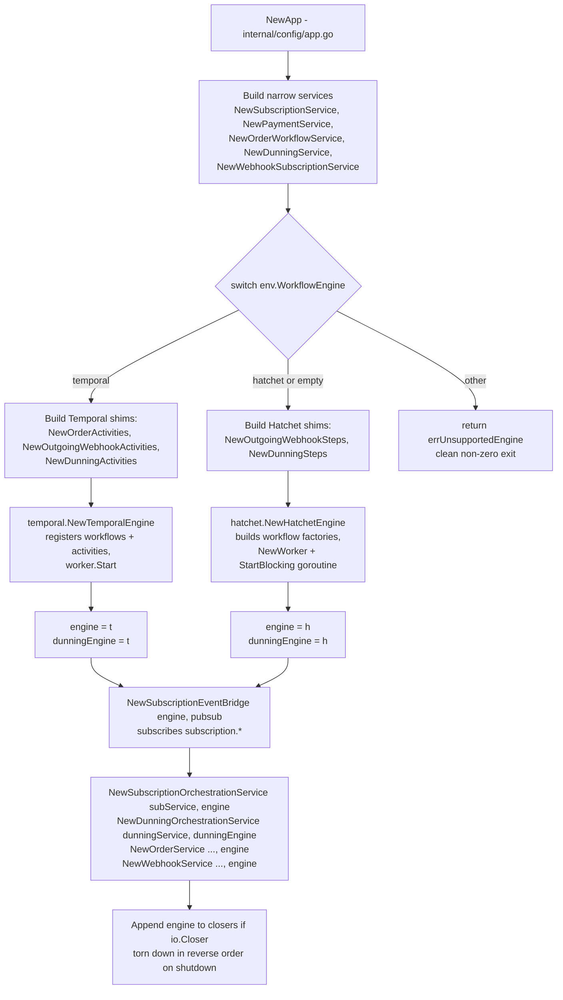
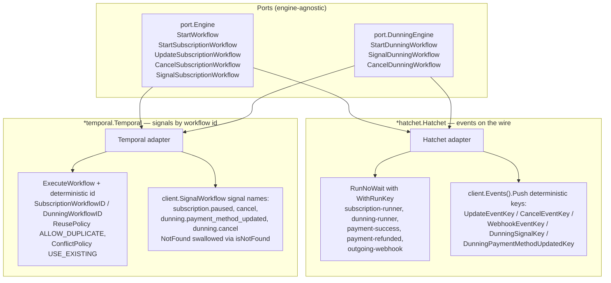

# Workflow Engine Abstraction (Hatchet ⇄ Temporal)

GetPaidHQ runs durable workflows behind two interchangeable ports, `port.Engine` and `port.DunningEngine`, both defined in `internal/core/port/workflow.go` and `internal/core/port/dunning.go`. At boot, `NewApp` in `internal/config/app.go` reads `env.WorkflowEngine` (the `WORKFLOW_ENGINE` env var, defaulting to `hatchet`) and constructs exactly one concrete adapter: `*hatchet.Hatchet` or `*temporal.Temporal`. Each adapter wraps the *same* engine-agnostic domain services in its own shim layer — Hatchet "steps" / workflow factories versus Temporal "activities" — so the business logic is reused unchanged across both runtimes. The same concrete value is assigned to both `engine` and `dunningEngine`, since each adapter type satisfies both interfaces.

## How it works

### Engine selection at boot
`NewApp` first constructs every **narrow service** with no workflow-engine dependency (`service.NewSubscriptionService`, `service.NewPaymentService`, `service.NewOrderWorkflowService`, `service.NewDunningService`, `service.NewWebhookSubscriptionService`) in `internal/config/app.go`. The `switch env.WorkflowEngine` then picks an adapter:

- `"temporal"`: builds the activity shims `temporalact.NewOrderActivities`, `NewOutgoingWebhookActivities`, `NewDunningActivities`, then `temporal.NewTemporalEngine` (`internal/adapter/temporal/temporal.go`).
- `"hatchet"` or `""` (default): builds the step shims `hatchetsteps.NewOutgoingWebhookSteps`, `NewDunningSteps`, then `hatchet.NewHatchetEngine` (`internal/adapter/hatchet/hatchet.go`).
- anything else: returns `errUnsupportedEngine(env.WorkflowEngine)` — a config error surfaced as a clean non-zero exit rather than a panic.

The single concrete value is assigned to both `engine port.Engine` and `dunningEngine port.DunningEngine`.

### Construction order: narrow → engine → orchestration
The ordering is load-bearing. Narrow services come first because adapters take them as constructor args (engine-agnostic business logic). The engine is built next. Only afterward are the **engine-aware** services constructed: `service.NewSubscriptionOrchestrationService(subService, engine, …)`, `service.NewDunningOrchestrationService(dunningService, dunningEngine, …)`, `service.NewOrderService(…, engine, …)`, and `service.NewWebhookService(…, engine, …)`. HTTP handlers depend on the orchestration services; the orchestration services depend on the engine port. `service.NewSubscriptionEventBridge(engine, pubsub, logger)` is wired between engine selection and the orchestration layer — it `Subscribe`s to `subscription.*` and, on `port.TopicSubscriptionPaused`, calls `engine.UpdateSubscriptionWorkflow` (see `internal/core/service/subscription_event_bridge.go`). This fan-in lives in the service layer, identical for both engines, instead of being duplicated in each adapter.

### Same services, two shim layers
Hatchet's factories in `NewHatchetEngine` (`internal/adapter/hatchet/hatchet.go`) wire the narrow services directly: `hatchetwf.NewPaymentSuccessWorkflow(c, orderService, subscriptionRepo, h)` (passes `h` back through the port so payment-success can spawn the subscription runner), `NewBillingCycleWorkflow(c, subscriptionService)`, `NewSubscriptionRunnerWorkflow`, plus `NewDunningAttemptWorkflow(c, dunningSteps)` / `NewDunningRunnerWorkflow(c, dunningSteps)`. They register on worker queue `"getpaidhq-events"` with `WithSlots(50)` and `WithDurableSlots(500)`, run via `StartBlocking` in a goroutine cancellable by `Close()`.

Temporal's `NewTemporalEngine` registers the parallel `workflows.*` functions plus `RegisterActivity` for `orderActivities`, `webhookActivities`, `dunningActivities` on task queue `env.TemporalTaskQueue` (default `"getpaidhq-events"`), then `w.Start()`. Both adapters expose `Close()` (`io.Closer`); `NewApp` appends the engine to `closers` and tears it down in reverse order on shutdown.

### Parity workflow set
Both engines register the same eight workflows:

| Workflow | Hatchet factory | Temporal function |
| --- | --- | --- |
| Payment success | `NewPaymentSuccessWorkflow` (`payment-success`) | `PaymentSuccessWorkflow` |
| Payment refunded | `NewPaymentRefundedWorkflow` (`payment-refunded`) | `PaymentRefunded` |
| Outgoing webhook | `NewOutgoingWebhookWorkflow` (`outgoing-webhook`) | `OutgoingWebhookWorkflow` |
| Subscription runner | `NewSubscriptionRunnerWorkflow` (`subscription-runner`) | `SubscriptionWorkflow` |
| Billing cycle | `NewBillingCycleWorkflow` | `BillingCycleWorkflow` |
| Charge reminder | `NewSubscriptionChargeReminderWorkflow` | `SubscriptionChargeReminder` |
| Dunning runner | `NewDunningRunnerWorkflow` (`dunning-runner`) | `DunningRunnerWorkflow` |
| Dunning attempt | `NewDunningAttemptWorkflow` | `DunningAttemptWorkflow` |

### One-shot vs per-aggregate runners
`StartWorkflow(id port.WorkflowType, payload any)` handles fire-and-forget flows. Both adapters `switch` on the same `port.WorkflowType` constants (`WorkflowPaymentSuccess`, `WorkflowPaymentRefunded`, `WorkflowOutgoingWebhook`) and coerce the payload via `domain.ParsePaymentWebhookContext` / a `port.OutgoingWebhookPayload` type assertion, returning a `port.WorkflowResult`. Unknown types log a warning and return an empty result. Hatchet uses `client.RunNoWait`; Temporal uses `client.ExecuteWorkflow` with `lib.GenerateId(...)` ids.

The per-aggregate lifecycle methods diverge in mechanism but match in semantics:

- **Hatchet** (event-driven): `StartSubscriptionWorkflow` calls `RunNoWait("subscription-runner", sub, WithRunKey(SubscriptionRunKey(...)))` for idempotency; `UpdateSubscriptionWorkflow`, `CancelSubscriptionWorkflow`, and `SignalSubscriptionWorkflow` push events via `client.Events().Push` keyed by `UpdateEventKey` / `CancelEventKey` / `WebhookEventKey` (the `"webhook-signal"` case maps to `WebhookEventKey`). Dunning mirrors this with `DunningRunKey`, `DunningSignalKey`, and `DunningPaymentMethodUpdatedKey` (`internal/adapter/hatchet/workflows/dunning_keys.go`).
- **Temporal** (signal-driven): workflow ids are deterministic via `SubscriptionWorkflowID` / `DunningWorkflowID` (`internal/adapter/temporal/workflows/keys.go`). Starts use `ExecuteWorkflow` with `WORKFLOW_ID_REUSE_POLICY_ALLOW_DUPLICATE` + `WORKFLOW_ID_CONFLICT_POLICY_USE_EXISTING` (idempotent re-attach). Updates/cancels use `client.SignalWorkflow` with named signals — `SignalCancelRunner` (`"cancel"`), `SignalDunningCancel` (`"dunning.cancel"`), `SignalDunningPaymentMethodUpd` (`"dunning.payment_method_updated"`), and `WebhookSignalName(...)` for the `"webhook-signal"` case. A `serviceerror.NotFound` (detected by `isNotFound`) is swallowed and treated as a no-op, since signaling a finished/absent runner is benign.

### Error and idempotency handling
`StartDunningWorkflow` in both adapters derives `campaignId` from `input.Metadata["campaign_id"]`, falling back to `input.SubscriptionId`, and returns `(workflowName/workflowId, runId)` for the orchestrator to persist. Hatchet returns the literal `"dunning-runner"` name plus `ref.RunId`; Temporal returns `we.GetID()` + `we.GetRunID()`. Failed pushes/signals are logged and, for subscription updates, reported through `errorReporter.ReportError` with org/subscription context.
