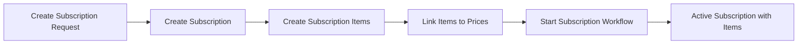
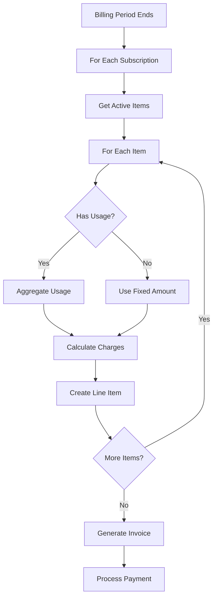

# GetPaidHQ Usage-Based Billing with Subscription Items
## Technical Specification
---

## 1. Overview

This specification extends GetPaidHQ's usage-based billing system to support subscription items, enabling multiple products/services per subscription with independent usage tracking and billing.

### Key Concepts
- **Subscription**: Container for multiple billable items
- **Subscription Item**: Individual product/service within a subscription
- **Usage Record**: Consumption data linked to specific subscription items

### Amount/Currency Strategy

- Keep amount and currency as optional fields in Subscription model
- Simple subscriptions: Use subscription-level amount (backward compatible)
- Multi-item/usage subscriptions: Set amount to NULL, calculate from items
- API responses: Include computed totals for consistent client experience

### Design Principles
- Each subscription can contain multiple items
- Each item tracks its own usage independently
- Items can have different billing models (fixed, usage, hybrid)
- Backward compatibility with existing single-product subscriptions


### Subscription Value Strategy

- Simple subscriptions: Use amount field at subscription level
- Multi-item subscriptions: Set amount to NULL, calculate from items
- API responses: Always include computed values for consistency
- Database queries: Use items for accurate billing calculations


## Plan Change Scenarios (Single Item Per Subscription)
### Fixed → Fixed (e.g., Basic $29 → Pro $99)
Current: Basic Plan - $29/month
Change to: Pro Plan - $99/month

Process:
1. Calculate proration credit for unused Basic time
2. Create new subscription item (Pro)
3. Deactivate old subscription item (Basic)
4. Charge prorated difference
5. Update subscription.amount to $99

## Fixed → Usage-Based (e.g., $29/mo → $0.01 per API call)
   Current: Flat Rate - $29/month
   Change to: Pay per use - $0.01/call

Process:
1. Calculate proration credit for unused fixed time
2. Create new usage-based subscription item
3. Deactivate fixed item
4. Set subscription.amount = NULL (now usage-based)
5. Apply credit to future usage charges

### Usage → Fixed (e.g., Pay-per-use → $99/mo unlimited)
   Current: $0.01 per API call
   Change to: Unlimited - $99/month

Process:
1. Finalize all pending usage for current period
2. Generate final usage invoice
3. Create new fixed subscription item
4. Start fixed billing from next period
5. Set subscription.amount = 99

### Usage → Usage (e.g., Change pricing tiers)
   Current: $0.01 per API call
   Change to: $0.005 per API call (volume discount)

Process:
1. Close current usage period at old rate
2. Create new item with new pricing
3. Future usage billed at new rate
4. subscription.amount remains NULL

### Hybrid → Any (e.g., $29/mo + $0.01/call → something else)
   Current: Base + Usage
   Change to: New plan

Process:
1. Prorate fixed portion
2. Finalize usage portion
3. Apply credits/charges
4. Create new item structure

Overview
This specification extends GetPaidHQ to support usage-based billing including percentage-based transaction fees, unit-based usage (API calls, storage), and hybrid models combining fixed subscriptions with variable usage charges. The system maintains backward compatibility while adding sophisticated usage tracking and billing capabilities.
Key Design Decisions Made
Timing Strategy

Fixed Subscriptions: Generate invoice 1 hour before billing date (predictable)
Usage Billing: Generate invoice 1+ hours after billing period ends (requires complete usage data)
Invoice-First Approach: Always generate invoice before attempting payment

Schema Philosophy

Extend existing models minimally to maintain backward compatibility
Use calculated fields instead of stored timing fields where possible
Support multiple billing models in single system

Billing Models Supported

Fixed Only: Traditional subscription ($29/month)
Usage Only: Pure consumption billing (pay per API call)
Hybrid: Fixed base + usage fees ($29/month + 0.05% transaction fees)
Percentage-Based: Transaction fees, revenue sharing (0.05%, 2.9% + $0.30)
Unit-Based: API calls, storage, bandwidth usage

Feature Summary
Core Capabilities

✅ Real-time usage recording via API
✅ Automatic usage aggregation by billing period
✅ Transparent invoice generation with usage breakdowns
✅ Support for percentage and unit-based pricing
✅ Hybrid subscription + usage billing
✅ Customer usage dashboards and notifications
✅ Proration handling for plan changes
✅ Usage dispute and adjustment workflows

Business Value

Revenue Growth: Capture usage-based revenue streams
Customer Transparency: Clear billing with detailed usage breakdowns
Flexible Pricing: Support complex pricing models (Stripe, AWS, Twilio-style)
Reduced Disputes: Pre-payment invoice generation with usage details
Better Cash Flow: Predictable billing with usage projections


Implementation Flow
Overall Architecture
┌─────────────────┐    ┌──────────────────┐    ┌─────────────────┐
│  Usage Events   │───▶│  Aggregation     │───▶│ Invoice         │
│  (Real-time)    │    │  (Daily/Period)  │    │ Generation      │
└─────────────────┘    └──────────────────┘    └─────────────────┘
│
▼
┌─────────────────┐
│ Payment         │
│ Processing      │
└─────────────────┘
## Billing Flow by Model Type
### Fixed Subscription Flow
Day -1, 23:00 → Generate invoice ($29.00)
Day -1, 23:30 → Send invoice notification  
Day  0, 00:00 → Attempt payment charge
Day  0, 00:15 → Update subscription cycle
### Usage Billing Flow
Day  0, 00:00 → Billing period ends
Day  0, 00:30 → Aggregate usage data
Day  0, 01:00 → Generate invoice ($29.00 + $47.50 usage)
Day  0, 01:30 → Send invoice notification
Day  0, 02:00 → Attempt payment charge
### Hybrid Model Flow (Fixed + Usage)
Day  0, 00:00 → Billing period ends (e.g., Jan 31 → Feb 1)
Day  0, 00:30 → Aggregate January usage (transaction fees)
Day  0, 01:00 → Generate invoice:
- Base subscription: $29.00
- Transaction fees: $47.50 (0.05% of $95,000 volume)
- API overage: $12.50 (2,500 calls over 10,000 limit)
- Total: $89.00
Day  0, 01:30 → Email customer with detailed breakdown
Day  0, 02:00 → Attempt payment ($89.00)

---

## 2. Data Model

### 2.1 New Model: SubscriptionItem

```prisma
model SubscriptionItem {
  orgId          String   @map("org_id")
  id             String   @default(cuid())
  subscriptionId String   @map("subscription_id")

  // Product/Price reference
  priceId        String   @map("price_id")
  productId      String?  @map("product_id")
  variantId      String?  @map("variant_id")

  // Item details
  name           String
  description    String?
  status         SubscriptionItemStatus @default(active)

  // Quantity for fixed items
  quantity       Int      @default(1)

  // Billing
  amount         Int?     // Fixed amount per period (null for pure usage)
  currency       String

  // Usage configuration
  hasUsage       Boolean  @default(false) @map("has_usage")
  usageType      String?  @map("usage_type") // "metered", "licensed"
  aggregationType String? @map("aggregation_type") // "sum", "max", "last_during_period"

  // Metadata
  metadata       Json?
  createdAt      DateTime @default(now()) @map("created_at")
  updatedAt      DateTime @updatedAt @map("updated_at")

  // Relationships
  subscription   Subscription @relation(fields: [orgId, subscriptionId], references: [orgId, id])
  price          Price @relation(fields: [orgId, priceId], references: [orgId, id])
  usageRecords   UsageRecord[]
  org            Org @relation(fields: [orgId], references: [id])

  @@id([orgId, id])
  @@index([orgId, subscriptionId])
  @@index([orgId, subscriptionId, status])
  @@map("subscription_items")
}

enum SubscriptionItemStatus {
  active
  paused
  cancelled
  pending
}
```

### 2.2 Updated Models

```prisma
// Update UsageRecord
model UsageRecord {
  orgId                String   @map("org_id")
  id                   String   @default(cuid())
  subscriptionId       String   @map("subscription_id")
  subscriptionItemId   String   @map("subscription_item_id") // NEW: Link to specific item
  customerId           String   @map("customer_id")

  // Link to price configuration
  priceId              String   @map("price_id")

  // Usage identification
  usageType            String   @map("usage_type")

  // Unit-based usage
  quantity             Decimal? @db.Decimal(15, 4)
  unitPrice            Int?     @map("unit_price")

  // Percentage-based usage
  transactionValue     Int?     @map("transaction_value")
  percentageRate       Decimal? @map("percentage_rate")
  calculatedFee        Int?     @map("calculated_fee")

  // Hybrid pricing
  fixedFee             Int?     @map("fixed_fee")

  // Final billing amount
  totalAmount          Int      @map("total_amount")

  // Time tracking
  usageDate            DateTime @map("usage_date")
  billingPeriod        String   @map("billing_period")

  // Processing status
  processed            Boolean  @default(false)
  processedAt          DateTime? @map("processed_at")
  invoiceId            String?  @map("invoice_id")

  // External references
  referenceId          String?  @map("reference_id")
  referenceType        String?  @map("reference_type")

  // Metadata and tracking
  metadata             Json?
  createdAt            DateTime @default(now()) @map("created_at")
  updatedAt            DateTime @updatedAt @map("updated_at")

  // Relationships
  subscription         Subscription @relation(fields: [orgId, subscriptionId], references: [orgId, id])
  subscriptionItem     SubscriptionItem @relation(fields: [orgId, subscriptionItemId], references: [orgId, id])
  customer             Customer @relation(fields: [orgId, customerId], references: [orgId, id])
  price                Price @relation(fields: [orgId, priceId], references: [orgId, id])
  org                  Org @relation(fields: [orgId], references: [id], onDelete: Cascade)
  invoice              Invoice? @relation(fields: [orgId, invoiceId], references: [orgId, id])

  @@id([orgId, id])
  @@index([orgId, subscriptionItemId, billingPeriod])
  @@index([orgId, subscriptionId, billingPeriod])
  @@index([orgId, processed, billingPeriod])
  @@index([orgId, usageType, usageDate])
  @@index([referenceId, referenceType])
  @@map("usage_records")
}


// Update Subscription model
model Subscription {
  // ... existing fields ...
  // REMOVED: priceId, productId, variantId (now in SubscriptionItem)
  // REMOVED: amount, currency (now in SubscriptionItem)

  // Status and lifecycle fields remain
  status SubscriptionStatus
  startDate DateTime?
  endDate DateTime?
  // ... other timing fields ...

  // New relationships
  items                SubscriptionItem[]

  // ... rest of existing relationships ...
}
```

---

## 3. API Endpoints

### 3.1 Subscription Item Management

```
GET    /api/v1/subscriptions/{subscription_id}/items
POST   /api/v1/subscriptions/{subscription_id}/items
GET    /api/v1/subscription-items/{item_id}
PATCH  /api/v1/subscription-items/{item_id}
DELETE /api/v1/subscription-items/{item_id}
POST   /api/v1/subscription-items/{item_id}/pause
POST   /api/v1/subscription-items/{item_id}/resume
```

### 3.2 Usage Recording

```
POST   /api/v1/subscription-items/{item_id}/usage
POST   /api/v1/subscription-items/{item_id}/usage/batch
GET    /api/v1/subscription-items/{item_id}/usage
GET    /api/v1/subscription-items/{item_id}/usage-summary
```

### 3.3 Usage Reporting

```
GET    /api/v1/subscriptions/{subscription_id}/usage-summary
GET    /api/v1/customers/{customer_id}/usage-summary
```

### 3.4 Invoice Generation

```
POST   /api/v1/subscriptions/{subscription_id}/generate-invoice
GET    /api/v1/subscriptions/{subscription_id}/preview-invoice
```

---

## 4. Core Flows

### 4.1 Subscription Creation Flow



### 4.2 Usage Recording Flow

```mermaid
graph TD
    A[Usage Event] --> B[POST /subscription-items/{id}/usage]
    B --> C{Validate}
    C -->|Valid| D[Create Usage Record]
    C -->|Invalid| E[Return Error]
    D --> F[Link to Subscription Item]
    F --> G[Store in Database]
    G --> H[Return Confirmation]
```

### 4.3 Billing Cycle Flow



---

## 5. Request/Response Examples

### 5.1 Add Item to Subscription

**Request:**
```json
POST /api/v1/subscriptions/sub_456/items
{
  "price_id": "price_api_calls",
  "has_usage": true,
  "usage_type": "metered",
  "aggregation_type": "sum"
}
```

**Response:**
```json
{
  "item": {
    "id": "si_790",
    "subscription_id": "sub_456",
    "name": "API Calls",
    "has_usage": true,
    "usage_type": "metered",
    "status": "active"
  }
}
```

### 5.2 Record Usage

**Request:**
```json
POST /api/v1/subscription-items/si_790/usage
{
  "quantity": 1000,
  "timestamp": "2025-01-15T10:30:00Z",
  "metadata": {
    "endpoint": "/api/v1/users",
    "method": "GET",
    "response_time_ms": 45
  }
}
```

**Response:**
```json
{
  "usage_record": {
    "id": "ur_123",
    "subscription_item_id": "si_790",
    "quantity": 1000,
    "usage_date": "2025-01-15T10:30:00Z",
    "billing_period": "2025-01",
    "total_amount": 50
  }
}
```

### 5.3 Get Usage Summary

**Request:**
```
GET /api/v1/subscriptions/sub_456/usage-summary?period=2025-01
```

**Response:**
```json
{
  "subscription_id": "sub_456",
  "period": "2025-01",
  "items": [
    {
      "item_id": "si_789",
      "name": "Professional Plan",
      "type": "fixed",
      "amount": 9900
    },
    {
      "item_id": "si_790",
      "name": "API Calls",
      "type": "usage",
      "usage": {
        "quantity": 157500,
        "included": 100000,
        "overage": 57500,
        "overage_rate": 0.05,
        "amount": 2875
      }
    },
    {
      "item_id": "si_791",
      "name": "Storage",
      "type": "usage",
      "usage": {
        "quantity": 125.5,
        "unit": "GB",
        "rate": 5.00,
        "amount": 627
      }
    }
  ],
  "subtotal": 13402,
  "tax": 0,
  "total": 13402
}
```

---

## 6. Use Cases

### 6.1 SaaS Platform with Add-ons

```
Customer: Acme Corp
Subscription:
├── Base Plan ($99/mo) - Fixed (category: subscription)
├── Premium Support ($29/mo) - Fixed add-on (category: subscription)
├── API Calls - Hybrid: 10k included, $0.01 overage (category: hybrid)
├── Storage - Usage-based ($5/GB) (category: usage)
└── Data Transfer - Usage-based ($0.10/GB) (category: usage)
```

**Price Configuration Examples:**
```json
// Base Plan
{
  "category": "subscription",
  "scheme": "fixed",
  "unit_price": 9900,
  "billing_interval": "month",
  "has_usage": false
}

// API Calls (Hybrid with overage)
{
  "category": "hybrid", 
  "scheme": "fixed",
  "unit_price": 0,
  "has_usage": true,
  "usage_type": "metered",
  "unit_type": "count",
  "aggregation_type": "sum",
  "included_usage": 10000,
  "overage_unit_price": 1
}

// Storage (Pure usage)
{
  "category": "usage",
  "scheme": "fixed", 
  "unit_price": 500,
  "has_usage": true,
  "usage_type": "metered",
  "unit_type": "gb_hours",
  "aggregation_type": "average"
}
```

### 6.2 Marketplace Platform

```
Customer: Online Store
Subscription:
├── Platform Fee ($49/mo) - Fixed (category: subscription)
├── Transaction Processing (2.9% + $0.30) - Percentage + fixed (category: usage)
├── Premium Analytics ($19/mo) - Fixed add-on (category: subscription)
└── SMS Notifications ($0.02 per SMS) - Usage-based (category: usage)
```

**Price Configuration Examples:**
```json
// Transaction Processing
{
  "category": "usage",
  "scheme": "fixed",
  "unit_price": 0,
  "has_usage": true,
  "usage_type": "metered",
  "unit_type": "transactions",
  "aggregation_type": "sum",
  "percentage_rate": 2.9,
  "fixed_fee": 30
}

// SMS Notifications
{
  "category": "usage", 
  "scheme": "fixed",
  "unit_price": 2,
  "has_usage": true,
  "usage_type": "metered",
  "unit_type": "count",
  "aggregation_type": "sum"
}
```

### 6.3 Telecommunications Bundle

```
Customer: John Doe
Subscription:
├── Voice Plan ($30/mo) - Hybrid: 500 min included, $0.05 overage (category: hybrid)
├── Data Plan ($25/mo) - Hybrid: 10GB included, $10/GB overage (category: hybrid)
├── International Roaming ($5/day when used) - Usage-based (category: usage)
└── Device Protection ($7/mo) - Fixed add-on (category: subscription)
```

**Price Configuration Examples:**
```json
// Voice Plan with overage
{
  "category": "hybrid",
  "scheme": "fixed",
  "unit_price": 3000,
  "billing_interval": "month",
  "has_usage": true,
  "usage_type": "metered", 
  "unit_type": "minutes",
  "aggregation_type": "sum",
  "included_usage": 500,
  "overage_unit_price": 5
}

// Data Plan with overage
{
  "category": "hybrid",
  "scheme": "fixed", 
  "unit_price": 2500,
  "billing_interval": "month",
  "has_usage": true,
  "usage_type": "metered",
  "unit_type": "gb",
  "aggregation_type": "sum", 
  "included_usage": 10,
  "overage_unit_price": 1000
}

// International Roaming (per day usage)
{
  "category": "usage",
  "scheme": "fixed",
  "unit_price": 500,
  "has_usage": true,
  "usage_type": "metered",
  "unit_type": "days",
  "aggregation_type": "sum"
}
```

### 6.4 Freemium with Tiered Pricing

```
Customer: Startup Inc
Subscription:
├── Free Plan ($0/mo) - Hybrid: 1000 API calls included (category: hybrid)
├── Pro Plan ($29/mo) - Hybrid: 10k calls included, $0.01 overage (category: hybrid)
└── Enterprise Plan ($99/mo) - Hybrid: 100k calls, $0.005 overage (category: hybrid)
```

**Price Configuration Examples:**
```json
// Free Plan
{
  "category": "hybrid",
  "scheme": "fixed",
  "unit_price": 0,
  "billing_interval": "month", 
  "has_usage": true,
  "usage_type": "metered",
  "unit_type": "count",
  "aggregation_type": "sum",
  "included_usage": 1000,
  "usage_limit": 1000
}

// Pro Plan with overage
{
  "category": "hybrid",
  "scheme": "fixed",
  "unit_price": 2900,
  "billing_interval": "month",
  "has_usage": true,
  "usage_type": "metered", 
  "unit_type": "count",
  "aggregation_type": "sum",
  "included_usage": 10000,
  "overage_unit_price": 1
}
```

---

## 7. Overage Pricing Deep Dive

### 7.1 Overage Pricing Overview

Overage pricing allows customers to have a base plan with included usage, and pay additional fees when they exceed the included amount. This is common in telecommunications, SaaS, and cloud services.

**Key Fields for Overage:**
- `unit_price`: Base plan price (fixed monthly/yearly fee)
- `included_usage`: Amount of usage included in base plan
- `overage_unit_price`: Price per unit when usage exceeds included amount
- `usage_limit`: Optional hard limit to prevent runaway charges

### 7.2 Overage Calculation Logic

```javascript
function calculateOverageCharges(usage, priceConfig) {
  const {
    unitPrice,           // Base plan price (e.g., $29/month)
    includedUsage,       // Free allowance (e.g., 10,000 API calls)
    overageUnitPrice,    // Overage rate (e.g., $0.01 per call)
    usageLimit          // Optional hard limit
  } = priceConfig;
  
  // Check usage limit
  if (usageLimit && usage.quantity > usageLimit) {
    throw new Error(`Usage limit exceeded: ${usage.quantity} > ${usageLimit}`);
  }
  
  // Calculate overage
  const overageQuantity = Math.max(0, usage.quantity - includedUsage);
  const overageAmount = overageQuantity * overageUnitPrice;
  
  return {
    baseAmount: unitPrice,
    includedQuantity: Math.min(usage.quantity, includedUsage),
    overageQuantity: overageQuantity,
    overageAmount: overageAmount,
    totalAmount: unitPrice + overageAmount
  };
}
```

### 7.3 Overage Billing Examples

#### Example 1: API Plan with Overage
```json
// Price Configuration
{
  "category": "hybrid",
  "unit_price": 2900,        // $29 base plan
  "included_usage": 10000,   // 10k API calls included
  "overage_unit_price": 1,   // $0.01 per additional call
  "usage_type": "metered",
  "unit_type": "count",
  "aggregation_type": "sum"
}

// Customer Usage: 15,000 API calls
// Calculation:
// - Base plan: $29.00
// - Included: 10,000 calls (free)
// - Overage: 5,000 calls × $0.01 = $50.00
// - Total: $29.00 + $50.00 = $79.00
```

#### Example 2: Data Plan with Hard Limit
```json
// Price Configuration  
{
  "category": "hybrid",
  "unit_price": 2500,        // $25 base plan
  "included_usage": 10,      // 10GB included
  "overage_unit_price": 1000, // $10 per additional GB
  "usage_limit": 50,         // Hard limit at 50GB
  "usage_type": "metered",
  "unit_type": "gb",
  "aggregation_type": "sum"
}

// Customer Usage: 35GB
// Calculation:
// - Base plan: $25.00
// - Included: 10GB (free)
// - Overage: 25GB × $10.00 = $250.00
// - Total: $25.00 + $250.00 = $275.00
// - Status: Within limit (35GB < 50GB limit)
```

#### Example 3: Free Plan with Usage Limit
```json
// Price Configuration
{
  "category": "hybrid", 
  "unit_price": 0,           // Free plan
  "included_usage": 1000,    // 1k API calls included
  "overage_unit_price": 0,   // No overage allowed
  "usage_limit": 1000,       // Hard limit enforced
  "usage_type": "metered",
  "unit_type": "count", 
  "aggregation_type": "sum"
}

// Customer Usage: 1,200 API calls
// Result: Usage blocked at 1,000 calls (hard limit)
// Invoice: $0.00 (free plan, but service throttled)
```

### 7.4 Invoice Line Item Breakdown

For overage billing, invoices should show clear breakdown:

```json
{
  "invoice_line_items": [
    {
      "subscription_item_id": "si_123",
      "description": "Pro API Plan - Base",
      "quantity": 1,
      "unit_price": 2900,
      "amount": 2900,
      "metadata": {
        "type": "base_plan",
        "included_usage": 10000
      }
    },
    {
      "subscription_item_id": "si_123", 
      "description": "API Calls - Overage",
      "quantity": 5000,
      "unit_price": 1,
      "amount": 5000,
      "metadata": {
        "type": "overage",
        "overage_quantity": 5000,
        "total_usage": 15000
      }
    }
  ],
  "subtotal": 7900,
  "total": 7900
}
```

### 7.5 Usage Warnings and Notifications

Implement proactive notifications to prevent bill shock:

```javascript
// Usage threshold alerts
const thresholds = [50, 75, 90, 100]; // Percentage of included usage

function checkUsageThresholds(currentUsage, includedUsage, thresholds) {
  const usagePercentage = (currentUsage / includedUsage) * 100;
  
  for (const threshold of thresholds) {
    if (usagePercentage >= threshold && !alertSent[threshold]) {
      sendUsageAlert({
        threshold: threshold,
        currentUsage: currentUsage,
        includedUsage: includedUsage,
        projectedOverage: calculateProjectedOverage(currentUsage, includedUsage)
      });
      alertSent[threshold] = true;
    }
  }
}
```

**Sample Alert Message:**
```
⚠️ Usage Alert: You've used 75% of your included API calls

Current usage: 7,500 / 10,000 calls
Projected overage: $25.00 (if current trend continues)
Plan: Pro API Plan ($29/month + $0.01 per additional call)

[View Usage Dashboard] [Upgrade Plan]
```

---

## 8. Workflow Modifications

### 7.1 SubscriptionWorkflow Changes

```
workflow SubscriptionWorkflow {
  input: {
    subscriptionId: string
    customerId: string
  }

  activities: {
    GetSubscriptionDetails()
    GetActiveSubscriptionItems()
    AggregateUsageForItem()
    GenerateInvoiceWithItems()
    ChargeCustomer()
  }

  mainLoop: {
    while (subscription.status === "active") {
      // Wait for billing date
      waitUntil(nextBillingDate)

      // Get all active items
      items = GetActiveSubscriptionItems(subscriptionId)

      // Process each item
      lineItems = []
      for (item in items) {
        if (item.hasUsage) {
          // Aggregate usage for the period
          usage = AggregateUsageForItem(item.id, billingPeriod)
          lineItem = calculateUsageCharges(usage, item)
        } else {
          // Fixed amount item
          lineItem = {
            amount: item.amount * item.quantity,
            description: item.name
          }
        }
        lineItems.push(lineItem)
      }

      // Generate invoice with all line items
      invoice = GenerateInvoiceWithItems(subscriptionId, lineItems)

      // Process payment
      result = ChargeCustomer(customerId, invoice.total)

      // Handle result...
    }
  }
}
```

### 7.2 New Activities

#### AggregateUsageForItem
```
input: {
  subscriptionItemId: string
  billingPeriod: string
  aggregationType: "sum" | "max" | "last"
}

process: {
  1. Query all unprocessed usage records for item in period
  2. Apply aggregation based on type
  3. Calculate total charges based on pricing rules
  4. Mark records as processed
  5. Return aggregated data
}

output: {
  totalQuantity: number
  totalAmount: number
  recordCount: number
}
```

#### GenerateInvoiceWithItems
```
input: {
  subscriptionId: string
  lineItems: Array<{
    subscriptionItemId: string
    description: string
    quantity?: number
    unitPrice?: number
    amount: number
    metadata?: object
  }>
}

process: {
  1. Create invoice record
  2. Create invoice line items for each subscription item
  3. Calculate totals
  4. Apply taxes if configured
  5. Set due date
}

output: {
  invoiceId: string
  total: number
  dueDate: datetime
}
```

---
